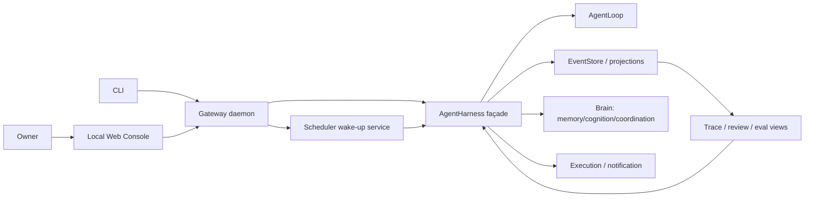

# M1 真实使用体验架构

本文实现 `requirements/05-m1-scope-decisions.md` 与 `06-m1-verification-strategy.md`。它是 M0 `03-foundation-architecture.md` 之上的增量架构：M0 crate 图、86 个 EventKind、harness-first、store 单写者和治理 enforce 点继续有效；M1 只增加控制面、后台服务、评价投影和按需能力装载。

## 0. 状态与激活边界

- 本文固定 M1 目标架构；M1-A 已激活并通过 S23-S28，M1-B 已激活并通过 S29-S33，M1-C 已激活并通过 S34-S37、A/B/M0 回归与合规门。
- M1 实现按 A/B/C 波次激活；M0 protocol 和 S1–S22 始终是不可回退的运行时基线。
- 本文没有新增 EventKind。需要的新事实优先由现有 run/action/intention/candidate/provider 事件表达。
- `BackendKind::Notification`、M1 控制面 DTO 已随 M1-A 同步进入 `forme-protocol`；M1-B 已补齐 versioned scheduler DTO、payload compatibility tests、migration note 与受治理 Notification backend；M1-C 只增加 additive `SchemaDigest`/optional MCP field 与 Context doctor row，并保持 Gateway、MCP、plugin 均无 Harness bypass。

## 1. 架构目标



关键点：

- Web/CLI 只认识 Gateway protocol，不读取 loop、SQLite 或 cognition 内部对象。
- Gateway 不新增对 store/eval/memory 的直接 crate 依赖；查询和 review 通过 Harness façade 到达 owner crate。
- Scheduler 只负责时钟与 wake-up，不拥有第二套 job truth；intention/event store 才是事实源。
- Trace Viewer 与 Manual Eval 默认只读。任何反馈进入系统时必须转成 candidate/retraction/feedback 的既有治理命令。

## 2. Crate 与依赖边

M1 不新增 workspace crate，也不新增内部 crate 依赖边。

| crate | M1 职责增量 | 依赖约束 |
|---|---|---|
| `protocol` | Surface/Gateway/cursor/control/eval DTO；Notification backend 参数。 | 仍为叶节点。 |
| `gateway` | daemon、loopback HTTP/SSE、static console、local auth、scheduler wake-up。 | 仍只依赖 protocol/harness/communication。 |
| `harness` | 控制/查询/review/schedule façade；保持所有运行入口和串行化。 | 复用现有 owner crate 依赖。 |
| `store` | cursor page、run/session summary projection、只读 snapshot。 | 单写者和不可变事件不变。 |
| `eval` | trace view、golden task/manual eval report。 | 通过 harness 暴露，不由 gateway 直依赖。 |
| `memory` | intention lease/recovery；topic/UserModel candidate projection。 | stable 写入仍 candidate-first。 |
| `cognition` | follow-up opportunity、review command、AttentionBudget 指标。 | 不自行执行 action。 |
| `context` | automatic compaction、scope search、lineage preservation。 | 不读未授权 raw dump。 |
| `capabilities` | skill 按需加载、dynamic MCP、plugin lifecycle。 | 解析结果不等于执行授权。 |
| `execution` | local Notification backend。 | 仍只执行 immutable approved plan。 |

Gateway 网络实现采用成熟 HTTP/SSE library，不手写 HTTP parser。M1-A 允许在 `gateway` manifest 引入 `tokio`/`axum`；这属于外部依赖，不改变内部 crate 图，必须补 dependency/license record。

## 3. 进程模型

M1 本地进程是一个 `forme-gatewayd`：

1. 默认仅绑定 `127.0.0.1`，随机或显式端口。
2. 创建唯一 Harness/Store/Provider/Backend 组合。
3. HTTP handler 只做认证、schema validation、调用 Harness façade 和 response mapping。
4. blocking harness/store 操作从 async transport 隔离，不能持有 async runtime lock 进入模型/tool 调用。
5. Scheduler wake-up 与 HTTP server 共进程，但只通过 Harness schedule API 触发 run。
6. daemon crash 后以 event/intention/lease 重建，不依赖内存队列恢复真相。

本地 Web 控制台由 gateway 作为静态资源提供，使用同源 API；第一版不引入桌面壳或第二套 Node server。控制台是工作面：run list/timeline、approval queue、trace、failure/candidate review、jobs 和 eval，不做营销页面。

## 4. M1 协议增量

所有对象带 `SchemaVersion`。字段是目标契约，最终以 protocol 实现和 schema tests 为准。

```rust
pub struct SurfaceProfile {
    pub schema_version: SchemaVersion,
    pub surface: SurfaceRef,
    pub kind: SurfaceKind,          // Cli | LocalWeb | LocalNotification
    pub trust: TrustTier,
    pub scope: Scope,
}

pub struct GatewayProfile {
    pub schema_version: SchemaVersion,
    pub surface: SurfaceRef,
    pub policy: PolicyProfileRef,
    pub model: ModelProfileRef,
    pub toolset: ToolsetRef,
    pub workspace: WorkspaceRef,
}

pub struct EventCursor {
    pub schema_version: SchemaVersion,
    pub run: RunId,
    pub after_stream_seq: u64,
}

pub struct ScheduleBinding {
    pub schema_version: SchemaVersion,
    pub session: SessionId,
    pub envelope: AutonomyEnvelope,
    pub budget: Budget,
}

pub struct ScheduleCommand {
    pub schema_version: SchemaVersion,
    pub intention: ProspectiveIntention,
    pub session: SessionId,
    pub envelope: AutonomyEnvelope,
    pub budget: Budget,
}

pub struct SchedulerConfig {
    pub schema_version: SchemaVersion,
    pub tick: DurationMs,
    pub lease: DurationMs,
    pub max_claims_per_tick: u32,
}

pub struct ApprovalDecision {
    pub schema_version: SchemaVersion,
    pub approval_id: ApprovalId,
    pub outcome: ApprovalOutcome,
    pub approver: VerifiedPrincipal,
    pub bound_plan_digest: PlanDigest,
    pub policy_version: Version,
    pub tool_schema_version: Version,
    pub nonce: Nonce,
    pub use_by: Timestamp,
}

pub enum RunControl {
    ResolveApproval(ApprovalDecision),
    Cancel(CancelRequest),
}

pub struct CandidateReviewCommand {
    pub schema_version: SchemaVersion,
    pub run: RunId,
    pub candidate: CandidateId,
    pub expected_state: CandidateReviewState,
    pub decision: CandidateReviewDecision,
    pub actor: Actor,
    pub evidence: Vec<EvidenceRef>,
    pub retraction: Option<CandidateRetraction>,
}

pub struct CandidateRetraction {
    pub schema_version: SchemaVersion,
    pub target: ObjectRef,
    pub lineage: LineageRef,
    pub derived_refs: Vec<ObjectRef>,
}

pub struct ManualEvalCase {
    pub schema_version: SchemaVersion,
    pub case_ref: EvalCaseRef,
    pub kind: GoldenTaskKind,
    pub request: RunRequest,
    pub workspace: WorkspaceRef,
    pub done_contract: DoneContractRef,
    pub allowed_capabilities: Vec<CapabilityRef>,
    pub policy: PolicyProfileRef,
    pub rubric: RubricRef,
    pub required_events: Vec<EventKind>,
    pub forbidden_events: Vec<EventKind>,
}

pub struct EvalProfile {
    pub schema_version: SchemaVersion,
    pub eval_ref: EvalRef,
    pub model: ModelProfileRef,
    pub policy: PolicyProfileRef,
    pub toolset: ToolsetRef,
    pub workspace: WorkspaceRef,
    pub event_schema: SchemaVersion,
    pub replay_snapshot: ReplaySnapshotRef,
}

pub struct ManualEvalReport {
    pub schema_version: SchemaVersion,
    pub eval_ref: EvalRef,
    pub case_ref: EvalCaseRef,
    pub run: RunId,
    pub trace_refs: Vec<EventId>,
    pub outcome: VerificationOutcome,
    pub rubric: RubricRef,
    pub snapshot: ReplaySnapshotRef,
    pub profile: EvalProfile,
}
```

Notification 增加 `BackendKind::Notification` 与结构化 `ActionParameters::Notification { surface, target, title, body_ref }`。正文不得把 secret 或未授权 private evidence 展开进事件；事件只存安全摘要/ref。

M1-B 复用既有 I 组事件并做兼容性字段增量：`ProspectiveIntentionCreated.schedule` 保存可回放的 session/envelope/budget；`OpportunityDetected.activation_shape` 对确定性 Commitment 为 `None`；`ProactiveProposalEmitted` 记录最终 delivery 与 `attention_cost`；`CompetenceInputs.verification_evidence` 让能力门事件明确引用 fail/unverifiable 结果证据。旧 payload 的新增字段按安全默认值读取，完整边界见 `m1-b-protocol-compatibility.md`。

`ApprovalDecision`、`CandidateReviewState` 和 `CandidateReviewDecision` 是 protocol 自有的边界 DTO，不能引用 approval/memory/cognition crate 的内部类型而形成反向依赖。M1-A Web approval 固定为 one-shot：Harness 把 `ApprovalDecision` 映射为 `ApprovalGrant { granted_scope: OneShot }`，合法 resolve 本身完成恢复；通用的 tool-outcome/handoff `ResumeInput` 不暴露到 Web 控制面。candidate 的 confirm 语义复用 `CandidatePromoted { by=user }`，不新增 `CandidateConfirmed` EventKind；retract 使用既有 `RetractionEvent -> ReevaluationTaskCreated`。

## 5. Harness Façade

Gateway 只能通过以下能力面进入系统；具体 trait 名可在 protocol/PRD 实现时机械落地，语义不可弱化：

```rust
pub trait GatewayControl: AgentHarness {
    fn start_run(self: Arc<Self>, request: RunRequest) -> Result<RunId>;
    fn list_runs(&self) -> Result<Vec<RunSummary>>;
    fn stream_event_page(&self, cursor: EventCursor) -> Result<EventPage>;
    fn run_summary(&self, run: RunId) -> Result<RunSummary>;
    fn pending_approvals(&self, session: SessionId) -> Result<Vec<PendingApproval>>;
    fn control(&self, run: RunId, control: RunControl) -> Result<()>;
    fn trace_view(&self, run: RunId) -> Result<TraceView>;
    fn review_candidate(&self, command: CandidateReviewCommand) -> Result<()>;
}

pub trait SchedulerGatewayControl: GatewayControl {
    fn schedule(&self, command: ScheduleCommand) -> Result<IntentionId>;
    fn list_jobs(&self) -> Result<Vec<ScheduledJob>>;
}

pub trait SchedulerService {
    fn tick(&self, now: Timestamp) -> Result<SchedulerTickReport>;
    fn cancel(&self, intention: IntentionId, actor: Actor) -> Result<()>;
    fn recover(&self, now: Timestamp) -> Result<RecoveryReport>;
}

pub trait ManualEvaluator: GatewayControl {
    fn run_case(&self, case: ManualEvalCase, profile: EvalProfile) -> Result<ManualEvalReport>;
    fn export_report(&self, eval: EvalRef) -> Result<ManualEvalReport>;
}
```

`GatewayControl`、`SchedulerGatewayControl`、`SchedulerService` 与 `ManualEvaluator` 由 Harness façade 实现，不由 Gateway handler 拼接 store/eval/memory 调用；`start_run` 在 Harness 内先校验、幂等归并并持久化 `RunAccepted`，随后返回 run id 由后台 worker 推进，任何 worker 启动/推进失败都必须把已接受 run 收敛到可审计 terminal 状态。每个 mutation 在 Harness 内重查 session、actor、scope、policy、digest 和当前状态。manual eval 的 rubric/归档逻辑由 eval owner 提供；BackgroundProactive case 必须经 schedule/tick 真实路径，不能把 `source=Schedule` 的普通 submit 伪装成后台验收。

## 6. HTTP/SSE 控制面

最小 API：

| 方法 | 路径 | 语义 |
|---|---|---|
| `POST` | `/v1/runs` | 提交 frozen `RunRequest`。 |
| `GET` | `/v1/runs/{run}` | 读取 run summary/projection。 |
| `GET` | `/v1/runs/{run}/events?after=N` | SSE；只发 `stream_seq > N`。 |
| `GET` | `/v1/sessions/{session}/approvals` | pending approvals。 |
| `POST` | `/v1/runs/{run}/control` | one-shot approval resolve / cancel union。 |
| `GET` | `/v1/runs/{run}/trace` | 只读 trace view。 |
| `POST` | `/v1/candidates/{id}/review` | candidate governance command。 |
| `GET/POST` | `/v1/jobs` | intention-backed schedule read/create。 |
| `POST` | `/v1/evals/run` | 运行 project-owned eval set。 |

SSE cursor 权威是 `(run_id, stream_seq)`。`Last-Event-ID` 只编码该 cursor；重连不 append event，不以 timestamp 猜测缺口。page response 固定 snapshot upper bound，避免边读边追加造成重复/跳过。

## 7. Trace、Review 与 Manual Eval

### 7.1 Trace View

Trace projection 按 `stream_seq` 折叠，提供：

- run/turn/model/tool/action/approval/verification timeline；
- GoalFrame/ResourcePlan/DoneContract/DecisionTrace refs；
- failure digest 与 related refs；
- candidate/retraction/reevaluation lineage；
- schema/policy/model/tool snapshot。

Trace 不展示或伪造模型内部隐推理。viewer 读取前后 event checksum 和 projection cursor 必须不变。

### 7.2 Review

review request 包含 candidate id、expected current state、actor、decision 和 evidence/feedback ref。Harness 使用 compare-current-state 语义防止双 review；合法迁移仍由 candidate owner 执行。retraction 必须触发派生再评估，不能物理删除历史。

### 7.3 Manual Eval

eval case 是 repository-owned structured fixture：input、workspace、done contract、allowed capability、policy profile、rubric、forbidden behavior。runner 通过 Gateway/Harness 运行真实路径，report 是带 schema/snapshot/trace refs 的派生 artifact。report 本身不进入 Agent 稳定认知；只有显式 review 后才能形成 candidate/failure evidence。

## 8. Background Scheduler

M1 不新增独立 `BackgroundJob` 权威表。`ProspectiveIntention` 是持久计划，scheduler 是 wake-up/claim 服务：

```text
Pending intention
  -> claim lease
  -> validate trigger/time/scope/envelope/budget
  -> submit RunRequest(source=Schedule, intention_id as intent key)
  -> Running
  -> Done | Deferred | Cancelled | OutcomeUnknown
  -> resolve intention or enter manual review
```

不变量：

- claim/lease 状态必须可从 event-backed intention store 重建。
- `ScheduleBinding` 与 intention trigger/seed/expiry/state 一并从事件重建；daemon 内存队列不是恢复输入。
- lease claim 使用“上一 intention 状态事件”作为 generation idempotency key；并发 live handle 中只有 store 原子 claim 的 winner 得到任务，loser coalesce，不能只依赖 deterministic run id 防重。
- 相同 intention/intent id 只映射一个 domain action claim。
- daemon restart 先扫描 `ActionStarted` 无 terminal 的 run；unknown side effect 不重试。
- 同 session 前台 run 优先；schedule run 排队，不交错写聚合。
- cancel、policy revoke、budget exhaustion 在下一 action 前生效并写事件。

## 9. Proactive Follow-up 与 Notification

第一批 trigger：

1. due Commitment；
2. `VerificationFinished{fail|unverifiable}` 或 high-impact FailureEvidence 的 follow-up。

它们先形成 observation/impulse/proposal，仍走三门与 AttentionBudget。verification follow-up 的 `CompetenceGateEvaluated.reads.verification_evidence` 必须引用实际结果事件；high-impact failure 则只写 `failure_evidence`，不得把 failure event 冒充 verification result。接受 delivery proposal 后才转 `ActionIntent(action_type=Deliver, backend=Notification)`；Notification backend 必须执行 plan digest、policy、approval 和 scope/target/body-ref recheck。quiet hours 下默认 hitchhike 到下一前台 surface，不主动弹出。

## 10. Context 与 Capability 效率

### Context

- automatic compaction 只在 token threshold 触发。
- preserved refs 至少包括 unresolved approval、tool outcome、DecisionTrace、FailureEvidence、candidate lineage、done contract。
- topic/session/project search 必须带 scope 和 provenance；跨 scope 默认 deny。

### Skills

`metadata -> bounded search/rank -> selected SkillBodyLoaded -> context slice`。search score 不改变 trust；未选正文不加载。

### MCP

dynamic discovery 可刷新 metadata；schema 延迟加载 只在选中工具后解析。schema digest 进入 execution plan；调用前重新确认 server enabled、allowlist、schema、policy 和 envelope。

### Plugins

lifecycle 是 `Discovered -> Configured -> Enabled -> Trusted -> Active -> Disabled|Failed`。reload 先构建新 contribution snapshot，验证后原子切换；失败保留旧安全 snapshot 或完全 disable，不能留下 ghost capability。

## 11. 安全边界

- daemon 默认 loopback；非 loopback bind 在 M1 拒绝启动。
- 首次启动生成 local bearer token，存于用户私有 runtime state，不进 repo/event/log。
- mutation API 要求 bearer + same-origin/CSRF proof；GET 也不返回 secret/raw private memory。
- UI 渲染所有模型/tool/external 内容为不可信数据，禁止 HTML 注入。
- event/trace export 走 disclosure/redaction policy。
- plugin/static asset 不能注册 Gateway bypass route。

## 12. 配置与可观测

建议配置键：

```text
gateway.bind = 127.0.0.1
gateway.port = 0
gateway.profile = local-owner
gateway.auth_token_ref = secret:gateway-local
scheduler.enabled = true
scheduler.tick_ms = 1000
scheduler.lease_ms = 30000
scheduler.max_claims_per_tick = 1
notification.enabled = true
notification.permission = permission:local-notification
context.compaction_threshold = 0.80
capabilities.search_limit = 8
```

配置 precedence 与 secret separation 延续 prd/16。hot reload 只能影响明确标为 reloadable 的值；policy/model/toolset 变化必须在下一 run/turn/action 绑定新 snapshot，不能静默改正在审批的 plan。

## 13. 实施顺序

1. M1 protocol DTO、schema tests、Harness façade，不新增 EventKind。
2. store/trace/read projections 与 cursor tests。
3. gateway daemon、loopback auth、HTTP/SSE、static console。
4. candidate review 与 manual eval。
5. intention scheduler/recovery 与 foreground priority。
6. Notification backend 与 proactive follow-up。
7. context compaction/scope search。
8. skill/MCP/plugin runtime efficiency。
9. S23–S37、golden tasks、真实模型与最终合规门。

## 14. 架构验收

- M1-A 对应 S23–S28。
- M1-B 对应 S29–S33。
- M1-C 对应 S34–S37。
- 每波都必须保持 S1–S22、86-event M0 taxonomy 和 compliance doctor 通过。
- 若实现发现必须新增 EventKind 或内部 crate edge，先回到 canonical/architecture 变更并经过单独评审，本文不构成绕过许可。

**当前状态（2026-07-15）**：A/B/C 三个架构激活门、S1-S37、真实配置模型 golden trace/eval 与合规门均 PASS。逐波证据见 `docs/acceptance/m1-a-acceptance-report.md`、`docs/acceptance/m1-b-acceptance-report.md`、`docs/acceptance/m1-c-acceptance-report.md`；最终结论见 `docs/acceptance/m1-acceptance-report.md`。M1 final PASS。
