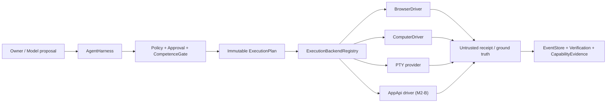

# M2 跨系统协作架构

本文实现 `requirements/07-m2-scope-decisions.md` 与 `08-m2-verification-strategy.md`。它是 M0/M1 架构之上的增量：18-crate 图、86-event taxonomy、Harness-first、store 单写者、执行前重查、审批绑定 plan digest、CompetenceGate、candidate-first、unknown-outcome 不盲重试全部继续有效。

M2 首次接触真实外部系统，因此激活 canonical §24。Browser/Computer/PTY/API/真实沟通只扩展已有接入缝和 `ActionBackend`；它们不能拥有 run、policy、stable memory 或事实源。

## 0. 状态与激活边界

- 本文冻结 M2-A/B/C 目标架构；实现已按波激活，每波均在 owner review 后进入下一波。
- M2-A 激活 Browser/Computer/PTY、外部动作治理与真实 browser golden。
- M2-A/B/C 均已实现并验收；M2 final 以 S1-S52、真实 Chrome/API、typed artifacts、strict clippy 与合规门收口。
- M2-A 不新增 EventKind；复用现有 Action/Policy/Approval/Verification/Capability 事件，并对 payload/enum 做 additive versioned 扩展。
- 任何内部 crate edge、新写者或 L3/L5 例外都需要先修改本文和 canonical，不由 driver 实现自行决定。
- 实施状态（2026-07-17）：M2-A/B/C 与 M2 final 均 PASS；18 crates、86 EventKinds 和既有内部依赖边保持冻结。

## 1. 架构目标



永久边界：

- Model/adapter/driver 只能提出或执行已经批准的规范化计划，不能决定权限和 trust。
- 每个真实副作用步骤都是一个独立 `ActionIntent/ExecutionPlan`，不能从开放 session 继承空白授权。
- 外部 observation 的 trust 由 Harness 按 backend/入口盖章；driver 返回值永远不能自报 owner authority。
- 真实 binary/blob 留在受限 artifact store/root，事件保存 ref/hash/安全摘要；credential 只以 `SecretRef` 流动。

## 2. Crate 与依赖边

M2 不新增内部 crate，也不新增内部依赖边。

| crate | M2 增量职责 | 依赖约束 |
|---|---|---|
| `protocol` | additive BackendKind、ActionParameters、driver/action DTO、output trust、connector/resource/sync DTO。 | 仍无内部依赖。 |
| `policy` | Browser origin、Computer surface、PTY program/root、connector scope 的执行前重查；managed layer 在 C 激活。 | 仍只依赖 protocol。 |
| `execution` | Browser/Computer/PTY/AppApi ActionBackend；driver trait、SecretResolver、bounded artifact/receipt。 | 仍只依赖 protocol/policy；第三方 driver library 不是内部 edge。 |
| `harness` | canonical §24 external-action floor、逐动作 approval、competence/evidence gate、untrusted provenance stamping、recovery。 | 复用既有依赖。 |
| `gateway` | B 波 connector/adapter transport，只调用 Harness façade。 | 不新增 gateway -> execution/store 旁路。 |
| `communication` | B 波真实 adapter、Disclosure/Termination/identity enforce。 | 仍依赖 protocol/policy/harness。 |
| `capabilities` | driver/connector capability lifecycle、结果证据、C 波 managed plugin snapshot。 | 不执行 action。 |
| `coordination` | C 波 ResourceGraph snapshot、长期 route 和 capability gap 只读引用。 | 不直接依赖 execution/store。 |
| `memory` | C 波 goal/artifact、hot/cold/sync projection 和 candidate lineage。 | store 仍唯一事实源。 |
| `store` | C 波 expected-version/CAS、sync cursor、tier projection。 | 不接受 adapter 直写。 |

M2-A 的直接第三方实现候选固定在 driver 边界：`headless_chrome = 1.0.22`（MIT）、`enigo = 0.6.1`（MIT）、`xcap = 0.9.6`（Apache-2.0）、`portable-pty = 0.9.0`（MIT）；URL 边界校验使用 `url = 2.5.8`（MIT OR Apache-2.0，与 headless_chrome 1.0.22 的解析依赖一致），不以字符串前缀代替 origin 解析。Cargo 必须精确 pin，借助公开 API 自主实现 adapter，不复制示例、错误文案或 fixture；正式记录进入 `docs/compliance/third-party-dependencies.md`。

## 3. M2 协议增量

所有稳定对象带 `SchemaVersion`。以下为冻结语义；具体字段以 protocol contract tests 为机械落点。

```rust
pub enum BackendKind {
    Shell, File, Mcp, Notification,
    Browser, Computer, Pty,             // M2-A
    AppApi,                              // M2-B additive activation
}

// M2 起 SecretRef 是 canonical 名；CredentialRef 保留为 wire-compatible 旧名。
pub type SecretRef = CredentialRef;

pub enum ExternalInput {
    Literal(String),
    Content(ContentRef),
    Secret(SecretRef),
}

pub struct BrowserActionSpec {
    pub schema_version: SchemaVersion,
    pub driver: ProviderId,
    pub target_url: String,
    pub allowed_origins: Vec<String>,
    pub operation: BrowserOperation,
    pub artifact_scope: Scope,
}

pub enum BrowserOperation {
    Navigate,
    ReadText { selector: Option<String> },
    Click { selector: String },
    Type { selector: String, input: ExternalInput },
    Screenshot { full_page: bool },
}

pub struct ComputerActionSpec {
    pub schema_version: SchemaVersion,
    pub driver: ProviderId,
    pub surface: SurfaceRef,
    pub bounds: CoordinateBounds,
    pub operation: ComputerOperation,
    pub artifact_scope: Scope,
}

pub enum ComputerOperation {
    Move { x: i32, y: i32 },
    Click { x: i32, y: i32, button: PointerButton },
    Type { input: ExternalInput },
    Key { key: KeyCode },
    Scroll { dx: i32, dy: i32 },
    Screenshot,
}

pub struct PtyActionSpec {
    pub schema_version: SchemaVersion,
    pub program: String,
    pub args: Vec<String>,
    pub cwd: String,
    pub cols: u16,
    pub rows: u16,
    pub input: Option<ExternalInput>,
    pub environment: Vec<SecretBinding>,
}

pub struct SecretBinding {
    pub schema_version: SchemaVersion,
    pub name: String,
    pub value: SecretRef,
}

pub enum ActionParameters {
    // existing variants remain unchanged
    Browser(BrowserActionSpec),
    Computer(ComputerActionSpec),
    Pty(PtyActionSpec),
    AppApi(AppApiActionSpec),             // M2-B additive activation
}

pub struct ExternalActionReceipt {
    pub schema_version: SchemaVersion,
    pub action: ActionId,
    pub content_ref: Option<ContentRef>,
    pub content_digest: Option<SchemaDigest>,
    pub trust: TrustTier,                 // external receipt = Untrusted
    pub effect: EffectStatus,             // Observed | Committed | Unknown
    pub probe_hint: Option<ProbeHintRef>,
}

pub struct ActionCompletedPayload {
    // existing fields remain unchanged
    pub receipt: Option<ExternalActionReceipt>, // serde default = None
}
```

`ActionOutputDeltaPayload` additive 增加 `trust: TrustTier` 与 `content_ref: Option<ContentRef>`；`ActionCompletedPayload` additive 增加 `receipt: Option<ExternalActionReceipt>`。legacy payload 缺字段时安全默认 `Untrusted/None/None`。Harness 为 action output 选择 envelope provenance，driver 无 provenance 写权；外部动作 completion receipt 随权威事件持久化，不能只存在于进程内返回值。

`ConfigCheck` 在 M2-A additive 增加 Browser、Computer、Pty；Connector 在 M2-B、Sync 在 M2-C 各自激活。逐波兼容边界分别见 `m2-a/b/c-protocol-compatibility.md`；M2-C 继续保持 86 EventKinds。

## 4. M2-A Driver 与 Backend 契约

### 4.1 公共执行边界

```rust
pub trait SecretResolver: Send + Sync {
    fn resolve(&self, reference: &SecretRef) -> Result<ResolvedSecret>;
}

pub struct DriverReceipt {
    pub schema_version: SchemaVersion,
    pub summary: String,
    pub content_ref: Option<ContentRef>,
    pub digest: Option<SchemaDigest>,
    pub effect: EffectStatus,
}

pub trait BrowserDriver: Send + Sync {
    fn perform(&self, action: &BrowserActionSpec, secrets: &dyn SecretResolver)
        -> Result<DriverReceipt>;
}

pub trait ComputerDriver: Send + Sync {
    fn perform(&self, action: &ComputerActionSpec, secrets: &dyn SecretResolver)
        -> Result<DriverReceipt>;
}
```

`BrowserBackend`、`ComputerBackend` 和 `PtyBackend` 继续实现冻结的 `ActionBackend`。Driver trait 只负责外部机制；plan validation、budget、timeout、cancel、event、evidence 和 result normalization 留在 `execution`。

`ResolvedSecret` 不实现 `Debug/Clone/Serialize/Display`，使用后清空内存的能力受标准库限制但不得被缓存或回显。既有 config 内部的 redacted `SecretValue` 不是跨 execution 边界的协议对象。M2-A 不要求真实 credential golden；所有 fixture 使用无 secret 的本地资源。

### 4.2 BrowserBackend

- `HeadlessChromeDriver` 仅实现有限 operation，不包含规划/selector 推理。
- target URL 必须是 `http/https` 且 origin 在 plan 的 allowlist；禁止 `file:`, `javascript:`, `data:` 和任意脚本注入。
- Click/Type 每次都是独立 plan。driver 不接受“执行一段 JS”或未绑定后续步骤。
- screenshot 写到 scoped artifact root，事件只保存 `ContentRef + digest + dimensions`；DOM/text 输出 bounded、标 `Untrusted`。
- 下载默认关闭；M2-A 不自动执行下载内容。

### 4.3 ComputerBackend

- `NativeComputerDriver` 用 `enigo` 执行有限键鼠动作，用 `xcap` 捕获显式 surface；不实现视觉推理。
- 每个动作绑定 surface、bounds、坐标/按键/input ref；越界先于 `ActionStarted` 拒绝。
- screenshot 写 scoped artifact；事件不内嵌 pixels。
- 默认不开启生产 driver；构造时必须显式提供允许 surface/bounds 和 driver profile。无配置即 backend 不注册。

### 4.4 PtyBackend

- 使用 `portable-pty`，不是 `std::process` 冒充 PTY，也不 fallback ShellBackend。
- program allowlist、canonical cwd root、固定 cols/rows、最小环境、有限输入、output budget、timeout/cancel。
- environment 只接受 `SecretBinding` 或实现提供的非敏感固定 allowlist；不继承父进程全部环境。
- 终态、timeout、cancel、spawn failure 都产明确 action/capability evidence；Started 后失去进程终态则进入 unknown-outcome 裁决。

## 5. Harness 外部动作咽喉

M2-A 在现有工具咽喉上增加约束，不建立第二条流程：

```text
ToolCallProposed
 -> capability/schema recheck
 -> policy.evaluate
 -> external_action_requirement
      L3 default: approval required unless explicit narrow L4 grant + evidence + competence
      L5: always one-shot owner approval
 -> ApprovalRequested/Resolved (plan digest bound)
 -> CompetenceGate (result evidence first)
 -> envelope/permission/scope/secret-ref recheck
 -> ActionPlanned
 -> backend.execute
 -> untrusted output provenance + terminal receipt
 -> Verification + CapabilityEvidence
```

规则：

- `Browser|Computer|Pty|AppApi` 或 `expected_effect=Outward` 进入 external guard；M1 已冻结的 owner-local notification 仍走其既有 L4 notification guard，它不是对外参与者动作，不能被该例外泛化到其他 outward backend。
- High risk、ExternalCommit、sensitive disclosure、不可回滚/rollback unknown -> L5，必须 one-shot owner approval。
- L4 只允许 low risk、窄 scope、有效 explicit envelope、`approval_rule=Allow`、结果证据非空且 CompetenceGate ceiling >= L4；任一不满足退回 L3 ask。
- approval 后 driver、target、origin/surface/program、operation、input/secret refs、scope、timeout、rollback 任一变化都会改变 digest并拒绝执行。
- ActionStarted 无可信 terminal 时，恢复扫描只追加 `ActionOutcomeUnknown`，不重新调用 driver。

## 6. 外部 observation 与 artifact

- `EventSink` 对 output payload 带 trust/content ref；Harness observer 根据 backend/入口覆盖为 `Untrusted` provenance。
- raw DOM/text/PTY output 可在当前 run 作为明确标注的数据使用；不能被解析成 owner command。
- screenshot/blob 放 `ArtifactStore` 抽象后的 scoped local root；M2-A 用文件实现，路径不得逃逸 workspace/runtime root，event 只存 ref/digest。
- trace/eval exporter 默认只输出 event identity/kind/sequence、plan/profile/schema/ref 和安全摘要；不输出 raw pixels、DOM、PTY transcript 或 ResolvedSecret。
- injection detection 失败不宣称完美过滤；只要内容尝试冒充 owner/改变固定治理，就记录 `safety_policy_failure` 并保持 quarantine。

## 7. M2-B Connector 与真实沟通（已实现并验收）

`AppApiConnector: ExternalProvider` 提供 schema/identity/SecretRef/rate/timeout，mutation 转 `ActionIntent{backend=AppApi}`。Gateway/Communication 真实 adapter 只 normalize 和 transport，所有发送仍经 Harness/DisclosurePolicy/ActionBackend。

真实 CommunicationSession 继续使用既有 `ExternalCommunicationGrant`、`DisclosurePolicy`、`TerminationPolicy`、participant identity、TTL/budget/transcript policy。Adapter 不拥有 stable memory，不可把外部参与者标成 owner。

## 8. M2-C 认知、协调与持久化（已实现并验收）

- `ResourceGraph` 是 event-derived projection：节点/边/score 带 scope、freshness、evidence refs 和 aggregate versions；Coordination 只读 snapshot，先按 inventory/trust 限定候选、再按 score 排序。DecisionTrace additive 绑定 snapshot ref；score 永不授权。
- 长期目标复用 GoalFrame/ProspectiveIntention/ExecutionRoute/checkpoint artifact。`GoalLineageSnapshot` 从既有事件重建；每步仍提交普通 ScheduleCommand 给 Harness。前台活动先 yield，budget/cancel/revoke 后停止，situation digest 漂移时 replan/review。
- CapabilityGap/CapabilityUpdateProposal 以 CapabilityEvidence/Verification/Failure/owner feedback 为主证据，自评只可压低；proposal 写 CandidateCreated，owner promote 后仅投影 proposal 内的窄 envelope，不自动改 trust/permission/spec。
- managed plugin policy 进入既有 `Managed` policy layer：policy/source/signature/manifest digest/allowlist/deny/revoke 全部验证后才提交完整 contribution snapshot。失败保留旧 generation；revoke 后整个 source 不可见，managed deny 不可放宽。
- hot/cold 是同一 event source 的可重建投影；selective recall 只返回 scope 内 refs。单 peer sync 使用 additive `VersionedEventStore`，在一个 immediate transaction 内做 expected-version/CAS、idempotent batch、cursor、redaction 和 conflict reporting。peer 必须在 store open 时显式配置并在 schema migration 事务中绑定/核对；未配置实例的 sync API fail closed，运行期请求没有 TOFU 注册权。
- C 波 additive payload、legacy default、store trait 和 transfer redaction 的机械契约见 `m2-c-protocol-compatibility.md`。

## 9. 安全、错误与恢复

| 条件 | 处理 |
|---|---|
| origin/surface/program/root 不允许 | policy deny；无 ActionStarted。 |
| external action 未达 L3/L5 审批 | RunWaiting/ActionDenied；不调用 driver。 |
| digest/schema/scope/secret ref 漂移 | approval 作废，重新规划/审批。 |
| driver timeout/cancel | terminal action event + CapabilityEvidence；不能标成功。 |
| Started 后结果不明 | ActionOutcomeUnknown + waiting/manual/probe；不重试。 |
| page/output prompt injection | Untrusted/quarantine；必要时 SafetyPolicy FailureEvidence。 |
| secret resolution/driver 回显异常 | fail closed；artifact gate 阻断验收。 |
| rollback 不成立 | 明确 non-retractable，升级 L5；补救不称 rollback。 |

## 10. 配置与 ConfigDoctor

```text
browser.enabled = false
browser.driver = headless-chrome
browser.executable = <explicit-or-discovered>
browser.allowed_origins = []
browser.artifact_root = <runtime-private>
computer.enabled = false
computer.driver = native
computer.allowed_surfaces = []
computer.artifact_root = <runtime-private>
pty.enabled = false
pty.allowed_programs = []
pty.allowed_roots = []
pty.inherit_environment = false
external_actions.default = ask
external_actions.l5_one_shot = true
sync.enabled = false
sync.peer = <one-owner-bound-peer>
sync.expected_version_cas = true
sync.batch_idempotency = true
sync.cursor_persistence = true
sync.redact_raw_content = true
sync.forbid_secret_refs = true
```

ConfigDoctor 必须解释 driver availability、origin/surface/program/root、artifact permissions、secret resolver、default approval posture，以及 sync 的单 peer/CAS/batch/cursor/redaction 前提。配置不完整时 backend/peer 不注册，而不是运行时猜测。

## 11. 实施顺序

1. canonical §24、requirements/07-08、本文和 prd/19 冻结并提交。
2. Protocol additive types、output trust、compatibility note/contract tests；EventKind 保持 86。
3. Policy external parameter recheck；Harness L3/L5/competence/evidence/approval/provenance guard。
4. Execution common driver/receipt/artifact/SecretResolver boundary。
5. BrowserBackend + real local-page golden。
6. ComputerBackend + bounded native/recording driver tests。
7. PtyBackend + true PTY fixture、timeout/cancel tests。
8. ConfigDoctor、dependency/borrowing records、S38-S42、M1 full regression、artifact validator。
9. 输出 `m2-a-acceptance-report.md` 并停下 owner review。
10. owner 通过 A 后实现/验收 B；owner 通过 B 后冻结 M2-C compatibility note，依次实现 ResourceGraph/long-term、capability/plugin、hot-cold/sync。
11. 输出 `m2-c-acceptance-report.md` 与 M2 final 报告，跑 S1-S52、真实 golden、artifact/secret scan、crate graph、strict clippy 与 compliance 后停下 owner review。

## 12. 架构验收

- M2-A：S38-S42；真实 browser golden；S1-S37、86-event taxonomy、crate graph、strict clippy、compliance 全绿。
- M2-B：S43-S47 + A/M1/M0 全回归。
- M2-C：S48-S52 + A/B/M1/M0 全回归。
- 任何 driver 旁路 Harness、raw credential 入 event、external content 自报 trust、L5 非逐动作审批、unknown outcome 重试都直接判波次失败。
