# M3 受控自进化架构

本文实现 `requirements/09-m3-scope-decisions.md` 与 `10-m3-verification-strategy.md`。它是 M0-M2 架构之上的增量：18-crate 图、Harness-first、event store 单写者、执行前重查、能力门在出口、candidate-before-promotion、M2 对外动作治理和 unknown-outcome 不盲重试全部继续有效。

M3 激活 canonical §25。进化控制面只拥有候选、回放、评估、稳定策略版本和 active ref；它不拥有 permission、approval、真实动作或历史事实的改写权。

## 0. 状态与激活边界

- 本文冻结 M3-A/B/C 目标架构；实施状态（2026-07-18）：三波均已通过 owner review 与分波门，M3-C/Final 通过 S1-S69、89-kind、18-crate、真实 browser evolution golden、typed artifacts、strict clippy、原创门与 clean-tree release audit。
- M3-A 先实现 replay/simulation/evaluation/promotion/activation/rollback；没有 A gate 不得激活 B/C 策略。
- M3-B 激活 LoopSpec、Coordination/WorkPattern、selection/model adaptation 的第一条受控进化链。
- M3-C 激活 StrategyMemory、AgentSelf/Partnership、Trust/Delegation recommendation、Proactivity/Communication 策略链和最终 golden。
- protocol 从 86 additive 到 89 EventKinds；新增事实只有 `EvolutionEvaluationRecorded`、`StrategyActivated`、`StrategyRolledBack`。
- 不新增内部 crate 或依赖边。冻结 trait 不改签名；M3 能力通过 additive companion trait/DTO 接入。

## 1. 架构目标

```mermaid
flowchart LR
  E["Event / Verification / Failure / Owner feedback"] --> C["StrategyCandidate"]
  C --> B["ReplayBundle"]
  B --> R["Exact Replay / Counterfactual Simulation"]
  R --> V["EvolutionEvaluator"]
  V --> G["StrategyEvolutionGovernor"]
  G --> P["Stable StrategyVersion"]
  P --> A["Impact gate + owner/CAS activation"]
  A --> S["Active strategy projection"]
  S --> H["Harness SessionBound: EvolutionSnapshot"]
  H --> O["Governed runtime outcomes"]
  O --> E
  O --> X["Regression / retraction"]
  X --> K["Append-only rollback"]
  K --> S
```



永久边界：

- Replay/Simulation 只能读事件或使用 deterministic fixture；effect-deny guard 在 Harness 内、execution backend 之前。
- Domain registry 只验证/解析策略内容；active ref 由 store 事件投影，不能藏在进程配置、plugin 或模型上下文中。
- Harness 在 run 开始解析一次 active refs，形成 `EvolutionSnapshot` 并写 `SessionBound`；下游只消费该 snapshot。
- Policy、Approval、CompetenceGate、Toolset、DisclosurePolicy 和 canonical §24 在 active strategy 之后再次 enforce。

## 2. Crate 与依赖边

M3 保持现有 18-crate 图，不新增边。

| crate | M3 增量职责 | 依赖约束 |
|---|---|---|
| `protocol` | Strategy/Replay/Evaluation/Activation/Rollback versioned DTO；3 个 additive EventKind；legacy defaults。 | 仍无内部依赖。 |
| `store` | Replay read snapshot、active strategy event projection、expected-version/CAS、rollback lineage。 | 仍只依赖 protocol；不执行评估。 |
| `eval` | ReplayBundle builder/exact verifier、baseline/holdout comparator、multi-dimensional fitness、artifact export。 | 仍只依赖 protocol/store；不反向依赖 loop/cognition/coordination。 |
| `cognition` | `StrategyEvolutionGovernor`、StrategyMemory conflict/decay、AgentSelf/Partnership/Trust/Proactivity candidate semantics。 | 仍依赖 protocol/memory/store；只产 decision/candidate。 |
| `loop` | 解析并执行 pinned LoopSpec version；seed fallback；拒绝未知/不兼容 spec。 | 不依赖 store/eval/cognition；由 Harness 注入 snapshot/spec。 |
| `coordination` | CoordinationRegistry、WorkPattern/role-weight spec、CoordinationFitness refs；仍只产约束/route。 | 不依赖 store/eval/execution。 |
| `capabilities` | SelectionPolicyRegistry；只在 lifecycle/permission/managed policy 过滤后的候选集排序。 | 不执行 action，不写 active pointer。 |
| `models` | Model adaptation profile 校验；ModelProfile capability 仍需结果证据。 | 不决定 promotion/activation。 |
| `memory` | Strategy candidate/AgentSelf/Partnership/Trust lineage 与 conflict graph 的事实投影。 | store 仍唯一权威 event source。 |
| `harness` | Simulation effect-deny、run snapshot pinning、调用 evaluator/governor、impact gate、activation/rollback append、真实 run 治理。 | 复用既有依赖；唯一跨域 orchestrator。 |
| `policy` / `approval` | 原有权限与审批不变量；验证 active strategy 不能放松当前规则。 | 不消费模型自评作为授权。 |
| `gateway` / `cli` | owner-authenticated promote/activate/rollback/read control surface。 | 只经 Harness façade，不直写 store projection。 |
| `communication` / `execution` | 消费 pinned policy ref；真实投递/动作继续按 M2 运行。 | 不感知 promotion，不提供 active storage。 |

M3-A 不要求新增第三方运行依赖。若后续为 license/security audit 引入工具，只作为 `tools/` 开发门或精确 pin 的 build dependency，并先更新第三方记录；不得引入一个通用 workflow/evolution framework替代本文控制面。

## 3. Protocol 增量

所有稳定对象带 `SchemaVersion`。标识与 digest 使用 protocol 新类型，禁止用 display name 或本机路径作为 identity。

```rust
pub enum StrategyDomain {
    Loop,
    Coordination,
    CapabilitySelection,
    ModelSelection,
    BackendSelection,
    ModelAdaptation,
    StrategyMemory,
    AgentSelf,
    Partnership,
    TrustDelegation,
    Proactivity,
    Communication,
}

pub enum EvolutionImpact {
    Cautious,      // shrink scope / add verification / lower autonomy
    Bounded,       // no scope, permission, trust or governance expansion
    Expansive,     // more proactive/confident, wider scope, less scaffolding
    Constitutional,// never auto-promotable/activatable
}

pub enum EffectMode {
    ExactReplay,
    CounterfactualDeny,
    LiveGoverned,
}

pub struct StrategyCandidate {
    pub schema_version: SchemaVersion,
    pub candidate: CandidateId,
    pub domain: StrategyDomain,
    pub scope: Scope,
    pub target_tier: StabilityTier,
    pub proposed_version: StrategyVersionRef,
    pub baseline: StrategyVersionRef,
    pub spec_ref: ContentRef,
    pub spec_digest: SchemaDigest,
    pub evidence: Vec<EvidenceRef>,
    pub provenance: Provenance,
    pub impact: EvolutionImpact,
    pub rollback_policy: StrategyRollbackPolicy,
}

pub struct EvolutionSnapshot {
    pub schema_version: SchemaVersion,
    pub snapshot: EvolutionSnapshotRef,
    pub aggregates: Vec<EvolutionAggregateVersion>,
    pub strategies: Vec<ActiveStrategyRef>,
    pub digest: SchemaDigest,
}

pub struct EvolutionAggregateVersion {
    pub schema_version: SchemaVersion,
    pub aggregate: EvolutionAggregateRef,
    pub version: AggregateVersion,
}

pub struct ReplaySnapshot {
    pub schema_version: SchemaVersion,
    pub event_schema: SchemaVersion,
    pub policy: PolicyProfileRef,
    pub loop_spec: LoopSpecRef,
    pub model: ModelProfileRef,
    pub tool_schema: SchemaDigest,
    pub driver_profiles: Vec<DriverProfileRef>,
    pub evolution: EvolutionSnapshot,
}

pub struct ReplayBundle {
    pub schema_version: SchemaVersion,
    pub bundle: ReplayBundleRef,
    pub cases: Vec<EvaluationCaseRef>,
    pub snapshot: ReplaySnapshot,
    pub effect_mode: EffectMode,
    pub content_digest: SchemaDigest,
}

pub enum EvaluationVerdict { Pass, Fail, Unverifiable }
pub enum FitnessOutcome { Pass, Fail, Unverifiable }

pub struct FitnessMetric {
    pub schema_version: SchemaVersion,
    pub dimension: FitnessDimension,
    pub outcome: FitnessOutcome,
    pub measured: Option<i64>,
    pub unit: FitnessUnit,
    pub evidence: Vec<EvidenceRef>,
}

pub struct EvolutionEvaluation {
    pub schema_version: SchemaVersion,
    pub evaluation: EvolutionEvaluationRef,
    pub bundle: ReplayBundleRef,
    pub baseline: StrategyVersionRef,
    pub candidate: StrategyVersionRef,
    pub case_set_digest: SchemaDigest,
    pub holdout_digest: SchemaDigest,
    pub metrics: Vec<FitnessMetric>,
    pub hard_invariants: Vec<InvariantResult>,
    pub ground_truth: Vec<EvidenceRef>,
    pub verdict: EvaluationVerdict,
}

pub struct StrategyActivation {
    pub schema_version: SchemaVersion,
    pub aggregate: EvolutionAggregateRef,
    pub domain: StrategyDomain,
    pub scope: Scope,
    pub from: Option<StrategyVersionRef>,
    pub to: StrategyVersionRef,
    pub evaluation: EvolutionEvaluationRef,
    pub promotion: EventId,
    pub owner_confirmation: Option<OwnerControlRef>,
    pub impact: EvolutionImpact,
    pub expected_version: EvolutionAggregateVersion,
    pub committed_version: EvolutionAggregateVersion,
}

pub struct StrategyRollback {
    pub schema_version: SchemaVersion,
    pub aggregate: EvolutionAggregateRef,
    pub domain: StrategyDomain,
    pub scope: Scope,
    pub failed: StrategyVersionRef,
    pub restored: StrategyVersionRef,
    pub triggers: Vec<EvidenceRef>,
    pub expected_version: EvolutionAggregateVersion,
    pub committed_version: EvolutionAggregateVersion,
    pub in_flight: InFlightDisposition,
    pub external_effects_reverted: HistoricalFalse,
}
```

`FitnessMetric.measured` 是带明确 unit 的整数（例如 millis、tokens、basis-points、count）；质量 correctness 仍以 typed outcome/evidence 表达，不允许 NaN/Infinity 或一个浮点总分控制 promotion。`HistoricalFalse` 与既有历史 evidence flag 一样只接受 wire `false`，防止序列化伪造“外部效果已回滚”。

### 3.1 Additive enums/payloads

- `Source` 追加 `Replay`、`Simulation`；旧枚举值和 wire 名不变。
- `SessionBoundPayload` additive 增加 `effect_mode: Option<EffectMode>` 与 `evolution_snapshot: Option<EvolutionSnapshotRef>`；legacy `None` 只表示历史未绑定 M3 snapshot，不能用于新的 M3 live run。
- `CandidateCreatedPayload` additive 增加 `strategy_candidate: Option<StrategyCandidate>`；legacy `None` 不构成 strategy candidate。
- `DecisionTraceRecordedPayload` additive 增加 `evolution_snapshot: Option<EvolutionSnapshotRef>`。
- `ConfigCheck` additive 增加 `Evolution` 与 `ReleaseAudit`。
- `ComplianceCheckResult` 的 scope additive 扩展 dependency/license/notice/release-tree/secret；不改变旧 upstream/license/copy 语义。

### 3.2 新事件

```rust
EvolutionEvaluationRecorded => EvolutionEvaluationRecordedPayload {
    evaluation: EvolutionEvaluationRef,
    baseline: StrategyVersionRef,
    candidate: StrategyVersionRef,
    verdict: EvaluationVerdict,
    hard_invariants: Vec<InvariantResultRef>,
    ground_truth: Vec<EvidenceRef>,
}

StrategyActivated => StrategyActivatedPayload {
    activation: StrategyActivation,
    active_snapshot: EvolutionSnapshotRef,
}

StrategyRolledBack => StrategyRolledBackPayload {
    rollback: StrategyRollback,
    active_snapshot: EvolutionSnapshotRef,
}
```

EventKind 顺序在既有第 86 项 `ComplianceCheckResult` 之后以 O 组 additive 追加上述三种；历史 86 种保持严格前缀、不重排、不改名。完整机械边界见逐波 `m3-*-protocol-compatibility.md`。

## 4. Replay、Simulation 与 Evaluation

### 4.1 Exact replay

`eval::ReplayEngine` 从 store 的一致性读快照构建 ReplayBundle。bundle 固定事件范围、每种 schema/upcaster identity、policy/loop/model/tool/driver/evolution refs 和 case digest。exact replay：

- 不调用 model provider、tool、ActionBackend、connector、communication adapter 或 SecretResolver；
- 按 `stream_seq` 重建 projection，校验 event checksum、migration identity、snapshot completeness 与 expected typed result；
- 只输出 replay report/projection diff，不 append 到被回放的历史 run；评估 run 自身可在独立 run id 下写审计事件。

### 4.2 Counterfactual simulation

Harness 用 `Source::Simulation` 建独立 run，并在最外层安装 `EffectMode::CounterfactualDeny`。它可调用 pinned loop/coordination/model fixture 比较候选，但任何工具或 outward proposal 在 execution 之前转成显式 `ActionDenied{simulation_effect_denied}`。

Simulation 结果只说明候选会怎样规划/提议，不可生成真实 success CapabilityEvidence。录制 outcome 可作为输入，但必须保留“recorded ground truth”与“simulated branch”标签。

### 4.3 Evaluation

```rust
pub trait ReplayEngine {
    fn build(&self, request: ReplayRequest) -> Result<ReplayBundle>;
    fn exact(&self, bundle: &ReplayBundle) -> Result<ReplayReport>;
}

pub trait EvolutionEvaluator {
    fn compare(&self, input: EvolutionComparison) -> Result<EvolutionEvaluation>;
}

pub trait StrategyEvolutionGovernor {
    fn decide(&self, candidate: &StrategyCandidate, evaluation: &EvolutionEvaluation,
              current: &EvolutionSnapshot) -> EvolutionDecision;
}
```

`ReplayEngine/EvolutionEvaluator` 由 eval 实现；`StrategyEvolutionGovernor` 是 cognition 的 additive companion trait，不修改冻结的 `EvolutionGovernor`。Governor 只返回 decision，Harness 检查 impact/owner/CAS 后 append event。

Evaluation 先检查 hard invariants，再比较逐维 metric：correctness/verification、failure/regression、cost/token、latency、interruption、over-delegation、risk exposure。任一 hard failure 直接 Fail；ground truth 缺失为 Unverifiable；不能用加权总分覆盖。

## 5. Stable Registry、Active Projection 与 Run Pinning

稳定策略 spec 以 immutable content ref + digest 保存，domain crate 只验证自身 spec：

```rust
pub trait LoopRegistry {
    fn resolve(&self, version: &StrategyVersionRef) -> Result<LoopSpec>;
}
pub trait CoordinationRegistry {
    fn resolve(&self, version: &StrategyVersionRef) -> Result<CoordinationPolicy>;
}
pub trait SelectionPolicyRegistry {
    fn resolve(&self, version: &StrategyVersionRef) -> Result<SelectionPolicy>;
}
pub trait EvolutionProjection {
    fn active(&self, domain: StrategyDomain, scope: Scope)
        -> Result<Option<ActiveStrategyRef>>;
    fn snapshot(&self, scope: Scope) -> Result<EvolutionSnapshot>;
}

pub trait EvolutionEventStore: EventStore {
    fn evolution_version(&self, aggregate: &EvolutionAggregateRef)
        -> Result<EvolutionAggregateVersion>;
    fn append_evolution_expected(&self, event: Event,
        aggregate: &EvolutionAggregateRef, expected: EvolutionAggregateVersion)
        -> Result<ExpectedAppend>;
}
```

`EvolutionProjection` 与 additive `EvolutionEventStore` 由 store 实现；冻结的 `EventStore`/`VersionedEventStore` 不改。M2 的 `VersionedEventStore` 以 RunId 为 aggregate，不能被误用为跨 run active strategy 的版本源。M3 使用显式 `EvolutionAggregateRef`（首版为 owner-bound workspace/global scope）和独立 version ledger：Harness 在 authenticated owner control run 中构造 `StrategyActivated/StrategyRolledBack`，store 在同一事务内比较 expected version、校验 payload aggregate/version、append event、推进 ledger 并更新 active projection。committed version 必须恰为 expected+1；CAS conflict 零写入。

active projection 的重建按 `(EvolutionAggregateRef, committed_version)` 排序并要求版本从 1 连续，不用跨 run timestamp/EventId 排序。事件仍属于触发它的普通 owner control run；不创建伪造的永久 control run，也不建立 event 之外的第二事实源。

Harness run binding 顺序：

```text
RunAccepted
 -> read policy/tool/model/workspace
 -> EvolutionProjection.snapshot(scope)
 -> validate every active spec/digest/compatibility
 -> SessionBound{evolution_snapshot,effect_mode}
 -> downstream runtime receives immutable snapshot
```

无法解析 active spec、digest 不符或与当前 schema/model/tool profile 不兼容时 fail closed；可显式回退 seed strategy，但必须先 append rollback/diagnostic，不能静默换版本。

## 6. Promotion、Activation 与 Rollback 状态机

候选生命周期沿用既有事件：

```text
CandidateCreated
  -> Evaluated(Pass|Fail|Unverifiable)
  -> CandidatePromoted | CandidateRejected | CandidateDowngraded
```

Active 生命周期独立：

```text
StableStrategyVersion
  -> StrategyActivated
  -> Active
  -> Superseded by later StrategyActivated
     | StrategyRolledBack to known-good version
```

Activation impact gate：

- `Cautious` 且缩 scope/增验证/降 autonomy/不改 permission/trust，可在 Pass + complete holdout 后自动激活。
- `Bounded` 默认需要明确配置允许自动激活；首版 M3 默认仍 owner confirmation。
- `Expansive` 必须 owner-authenticated control command；如果随后需要 permission/envelope 扩大，再走独立授权流程。
- `Constitutional` 在 M3 自动路径永远拒绝；只接受人工版本迁移，不复用 strategy activation API。

Rollback trigger 可来自 regression evaluation、FailureEvidence、RetractionEvent、RevocationEvent、schema incompatibility 或 owner command。进行中 run 的 disposition 只能是 `KeepPinned`、`Cancel` 或 `WaitForOwner`；不得热换。rollback payload 永远保存 `external_effects_reverted=false`。

## 7. M3-B Domain Architecture

### 7.1 LoopSpec

首版 evolvable fields 限于 phase ordering 的已知集合、trigger、checkpoint cadence、verification cadence、turn/token budget profile 和 failure fallback。Harness/Policy/Approval/DoneContract/event emission/maximum hard limits 不在 spec 中，domain validator 遇到相关字段直接拒绝。

### 7.2 Coordination/WorkPattern

CoordinationPolicy 可调整已注册 WorkPattern 的适用签名、resource/role weight、单/多 Agent 选择和 checkpoint topology。CoordinationFitness 必须同时读 verification、failure、cost、latency 与 over-delegation。Orchestrator 仍由 Harness spawn child run；role weight 不改变 toolset/permission/budget。

### 7.3 Selection/Model Adaptation

SelectionPolicy 的输入是已经过 lifecycle/permission/managed deny/scope filter 的候选集。排序输出仍需 ToolsetResolved/ResourcePlan/DecisionTrace；分数不注册新 capability。

Model adaptation 只选择更多或更少的外化脚手架。强模型不能减少高影响 DecisionTrace、verification、approval 或 failure capture；provider capability 声明必须和历史结果证据共同进入 eval。

### 7.4 Long horizon

长期项目由多个普通 Harness run/checkpoint 组成，每段绑定 snapshot。active strategy 变化只影响下一个 checkpoint run；旧 checkpoint artifact 保留原版本 ref。前台优先、budget/cancel/revoke 和 M2 outward action gates继续 enforce。

## 8. M3-C Domain Architecture

- **StrategyMemory**：strategy candidate/stable/active/evidence/derived lineage 是认知对象；conflict/freshness/decay/retraction 从事件重建。未信任 raw content 不直接形成边或 fitness。
- **AgentSelfModel**：结果证据更新 scoped reliability/gap；self observation 只能产 candidate 并压低 ceiling，不能产 permission/trust。
- **PartnershipModel**：只表达互补、协作、纠偏和授权建议；fixed identity/No-real-consciousness-claim 不在可演化 spec 中。
- **Trust/Delegation**：成功证据可形成窄 grant 建议，失败/撤销可自动降级。任何 trust/autonomy 扩大仍需 owner control + 既有 policy/approval 对象。
- **Proactivity/Communication**：可优化 trigger/summary/surface preference/AttentionBudget consumption 和表达策略；observation grant、recipient、disclosure、TTL、budget、L3/L5 不可由策略扩大。

这些 domain 都复用 `StrategyCandidate -> Evaluation -> Promotion -> Activation`；不得各自写 stable/active shortcut。

## 9. 安全、错误与恢复

| 条件 | 处理 |
|---|---|
| fixed/constitutional candidate | intake fail closed；记录 safety/learning failure。 |
| ReplayBundle snapshot/digest 缺失 | Unverifiable 或 replay failure；不 promotion。 |
| simulation 尝试真实 effect/secret resolution | ActionDenied + safety failure；driver 调用数必须为零。 |
| self-eval only / holdout 泄漏 / budget 不同 | evaluation Fail/Unverifiable。 |
| active CAS conflict | 零写入；调用方重读后重新决定，不盲重试 activation。 |
| active spec/schema/model/tool 不兼容 | run bind fail closed；显式 rollback/owner review。 |
| regression/retraction | reevaluation + downgrade/rollback；保留历史。 |
| rollback 后已有外部效果 | `external_effects_reverted=false`；补救走新 ActionIntent。 |
| untrusted content 修改 rubric/strategy/owner ref | quarantine/deny；不得进入 active projection。 |
| artifact 含 secret/private path | artifact/release gate FAIL。 |

## 10. 配置与 ConfigDoctor

```text
evolution.enabled = false
evolution.effect_mode = counterfactual-deny
evolution.auto_activate_cautious = true
evolution.auto_activate_bounded = false
evolution.require_owner_for_expansive = true
evolution.holdout_required = true
evolution.self_eval_can_promote = false
evolution.active_cas = true
evolution.rollback_on_hard_regression = true
evolution.max_cases = <bounded>
evolution.max_cost = <bounded>
evolution.artifact_root = <runtime-private>
release_audit.enabled = false
```

所有 M3 domain 默认 seed strategy；`evolution.enabled=false` 时允许读取历史 M3 events，但不生成 promotion/activation。ConfigDoctor 检查 replay artifact root、effect-deny guard、holdout、owner impact gate、CAS、seed/known-good strategy、rollback policy、secret scanner 和 release-audit availability。缺一项时相关自动 activation 禁用，而不是运行时猜测。

## 11. 可观测与 Artifact

owner view 只读 event-derived projection，至少展示：active domain/scope/version/digest、baseline/candidate metrics、hard failures、case/holdout digest、ground-truth refs、promotion actor、activation impact、rollback trigger、in-flight disposition。

ArtifactStore 保存 ReplayBundle、EvolutionEvaluation、promotion/activation/rollback report 和 portable trace manifest。event 只保存 ref/digest/安全摘要。导出不含 raw model delta、tool args、external body、ResolvedSecret、SecretRef id、本机绝对路径或 owner 私有内容。

## 12. 实施顺序与架构门

1. canonical §25、requirements/09-10、本文、architecture/03 taxonomy 和 prd/20 一次冻结并 owner review。
2. M3-A protocol compatibility/types/events -> store projection/CAS -> eval replay/evaluator -> cognition governor -> Harness effect-deny/pinning/impact gate -> artifacts/S53-S57。
3. M3-A 运行 S1-S57、89-kind、18-crate、strict clippy、compliance，输出报告并停下。
4. owner 通过 A 后实现 Loop/Coordination/Selection/Model adaptation/long-horizon，运行 S1-S62，输出 B 报告并停下。
5. owner 通过 B 后实现 StrategyMemory/Self/Partnership/Trust/Proactivity/Communication 与 golden/release audit，运行 S1-S69，输出 C/final 报告。该项已于 2026-07-18 完成，后续以 `acceptance/m3-acceptance-report.md` 为固定回归证据。

任何 replay 真实副作用、promotion 直接授权、mid-run 策略漂移、self-eval 自批、active lost update、rollback 删除历史或 L5 规则放松都直接判波次失败。
