# M4 单 Owner 联邦运行时架构

本文实现 `requirements/11-m4-scope-decisions.md` 与 `12-m4-verification-strategy.md`。它是 M0-M3 架构之上的增量：18-crate 图、Harness-first、EventStore 单写者、执行前重查、能力门在出口、candidate/stable/active/permission 分离、M2 对外动作治理和 M3 run-pinned strategy 全部继续有效。

M4 激活 canonical §26。联邦运行时只把 owner 控制入口、真实执行和只读副本延伸到受认证 peer；它不产生第二个大脑、第二个 policy owner、第二个事实源或第二个 authority。

## 0. 状态与冻结基线

- 本文已随 M4 规格 owner review 冻结，工程结果已合入 main；后续只能以 additive 兼容方式修订冻结面。
- 冻结基线为 M3 封板时的 main：18 crates、89 EventKinds、S1-S69、309 个常规 Rust tests、2 个真实浏览器 golden、19 个 Python gate tests 和 M3 release receipt `sha256:fc88e2184e29da666c5fc6373ee08d9829ae127899b901ddbd413364e5ba2c3e`。
- M4-A 先建立 peer trust plane、TLS transport、lease/fencing 和 RemoteExecutorBackend；没有 A gate 不得激活复制、跨设备审批或 handoff。
- M4-B 激活 authority -> finite peers 的只读复制，以及跨设备 owner approval/cancel。
- M4-C 激活受授权 placement、verified checkpoint handoff、全局调度和三进程 golden。
- protocol 已从 89 additive 到 93 EventKinds；只追加 `FederatedPeerRegistered`、`FederatedPeerRevoked`、`RemoteExecutionLeaseChanged`、`ReplicationCheckpointAdvanced`。
- 不新增内部 crate 或依赖边。冻结 trait 不改签名；M4 通过 additive DTO、companion trait 和既有 Harness orchestration 接入。

## 1. 架构目标

```mermaid
flowchart LR
  O["Authenticated owner"] --> G["Gateway / authority Harness"]
  G --> P["Policy + Approval + CompetenceGate"]
  P --> L["Plan-bound lease + fence"]
  L --> T["Authenticated encrypted transport"]
  T --> E["Executor peer: typed operation only"]
  E --> R["Receipt + untrusted output"]
  R --> V["Authority verifier + EventStore append"]
  V --> X["Filtered replication batch"]
  X --> Q["Read-only replica peer"]
  D["OwnerClient peer"] --> O
```



永久边界：

- owner control、policy、approval、strategy activation、scheduler 和事实 append 只在 authority。
- executor 收到的不是自然语言任务，而是经批准 plan digest 绑定的 typed operation + one-shot lease。
- replica 收到的是过滤/脱敏的 event envelope，只能构建可丢弃投影。
- 所有网络输入都先作为 authenticated sender + untrusted content 处理；transport identity 不提升内容 trust。
- 网络 partition 不产生 retry 权利。无法证明 terminal outcome 就保持 unknown。

## 2. Crate 与依赖边

M4 保持现有 18-crate 图，不新增反向边。

| crate | M4 增量职责 | 依赖约束 |
|---|---|---|
| `protocol` | Federation/peer/epoch/placement/lease/receipt/replication versioned DTO；4 个末尾事件；additive enum/payload。 | 仍无内部依赖。 |
| `store` | peer registry、authority epoch、federation snapshot、lease ledger、per-peer/per-aggregate checkpoint、replication export 与 read-only replica projection。 | 仍只依赖 protocol；不连接网络、不执行动作。 |
| `config` | authority/executor/replica mode、identity/endpoint refs、TLS profile、peer allowlist、retention 与 federation doctor inputs。 | 仍只依赖 protocol；不保存明文 credential。 |
| `execution` | `RemoteExecutorBackend`、authority-side `RemoteTransport`、executor-side admission/driver adapter、dispatch/probe/cancel。 | 仍只依赖 protocol/policy；不依赖 store/harness/gateway。 |
| `policy` / `approval` | Remote 默认至少 L3；L5、plan digest、one-shot grant、peer/scope/epoch/fence final recheck。 | 不把 peer health、TLS 或历史成功当 permission。 |
| `capabilities` | executor profile/capability lifecycle；placement 的已授权候选集。 | 只过滤/排序，不注册 peer、不发 lease。 |
| `coordination` | 远端 placement proposal、checkpoint handoff route 和 DecisionTrace refs。 | 不依赖 store/execution，不产生授权。 |
| `eval` | remote receipt/ground-truth verifier、replication/artifact verifier、federation threat/release checks。 | 仍只依赖 protocol/store；不直调 remote driver。 |
| `memory` / `cognition` | 消费 authority-verified outcome；能力/策略成长仍走候选与 M3 evaluation。 | remote self-report 不能形成 stable evidence。 |
| `harness` | 唯一 federation orchestrator：bind snapshot、调用 policy/approval/gate、CAS lease、dispatch、裁决 receipt/unknown、append event、checkpoint handoff。 | 复用既有依赖；不把网络 callback 变成旁路执行。 |
| `gateway` | owner/peer control surface、OwnerClient session、approval/cancel、peer lifecycle command。 | 只经 Harness façade；不直写 store projection。 |
| `communication` | peer transport identity 与 owner principal 分层；remote content trust/provenance。 | adapter 不自报 owner/trust，不拥有 peer registry。 |
| `loop` / `models` / `context` / `cli` | 消费 pinned federation snapshot/ref；其冻结职责不变。 | 不读远端私有状态，不感知 transport implementation。 |

M4-A 很可能需要 TLS server/client 支撑。实现前必须选择成熟库、精确 pin、登记 `docs/compliance/third-party-dependencies.md` 与 borrowing record，并由 release audit 检查 license/NOTICE/advisory。不得为了省依赖自研加密或明文传输。

## 3. Protocol 增量

所有稳定对象带 `SchemaVersion`。identity、epoch、version、lease、fence、cursor、receipt 和 digest 使用 protocol newtype；地址、主机名、证书正文、wall clock 和进程 id 不得作为 identity。

### 3.1 Peer、authority 与 snapshot

```rust
pub enum FederatedPeerRole {
    OwnerClient,
    Executor,
    Replica,
}

pub struct FederationAggregateVersion {
    pub schema_version: SchemaVersion,
    pub aggregate: FederationAggregateRef,
    pub version: u64,
}

pub struct FederatedPeerGrant {
    pub schema_version: SchemaVersion,
    pub peer: FederatedPeerRef,
    pub owner: VerifiedPrincipal,
    pub roles: Vec<FederatedPeerRole>,
    pub scopes: Vec<Scope>,
    pub capabilities: Vec<CapabilityRef>,
    pub transport_identity: TransportIdentityDigest,
    pub authority_epoch: AuthorityEpoch,
    pub grant_version: PeerGrantVersion,
    pub expires_at: Timestamp,
    pub created_by: OwnerControlRef,
}

pub struct FederationSnapshot {
    pub schema_version: SchemaVersion,
    pub authority: AuthorityRef,
    pub authority_epoch: AuthorityEpoch,
    pub registry_version: FederationAggregateVersion,
    pub grants: Vec<FederatedPeerGrantRef>,
    pub digest: SchemaDigest,
}
```

Validation requirements：

- owner、peer、roles、scope、identity digest、epoch、grant version、TTL 和 owner control ref 全部非空/非零；roles/scopes/capabilities 去重并稳定排序。
- TTL 必须有限且不能超过 managed maximum；`OwnerClient`、`Executor`、`Replica` 每种 role 都有独立 scope/capability validation。
- authority epoch 与 registry version 从 store projection/CAS 产生；wire sender 不能自报更高值。
- snapshot digest 覆盖 authority、epoch、registry version 和排序后的完整 grant refs/versions/digests；run 内不可热换。

### 3.2 Remote placement、lease 与 receipt

```rust
pub struct RemoteOperation {
    pub schema_version: SchemaVersion,
    pub backend: BackendKind,              // Remote 不可递归
    pub parameters: ActionParameters,
    pub capability: CapabilityRef,
    pub scope: Scope,
    pub action_type: ActionType,
    pub expected_effect: ExpectedEffect,
    pub rollback_boundary: RollbackBoundary,
    pub credential_slot: Option<ExecutorCredentialSlotRef>,
    pub digest: SchemaDigest,
}

pub struct RemotePlacementPlan {
    pub schema_version: SchemaVersion,
    pub executor: FederatedPeerRef,
    pub peer_grant: FederatedPeerGrantRef,
    pub grant_version: PeerGrantVersion,
    pub authority_epoch: AuthorityEpoch,
    pub executor_profile: ExecutorProfileRef,
    pub operation: RemoteOperation,
    pub digest: SchemaDigest,
}

pub enum RemoteLeaseState {
    Reserved,
    Acquired,
    Released,
    Expired,
    Fenced,
}

pub struct RemoteExecutionLease {
    pub schema_version: SchemaVersion,
    pub lease: RemoteExecutionLeaseRef,
    pub dispatch: RemoteDispatchId,
    pub intent: ActionId,
    pub plan_digest: PlanDigest,
    pub placement: RemotePlacementPlanRef,
    pub executor: FederatedPeerRef,
    pub peer_grant: FederatedPeerGrantRef,
    pub grant_version: PeerGrantVersion,
    pub authority_epoch: AuthorityEpoch,
    pub fence: FenceToken,
    pub expires_at: Timestamp,
    pub state: RemoteLeaseState,
}

pub enum RemoteReceiptOutcome {
    Completed,
    Failed,
    Cancelled,
    Unknown,
}

pub struct RemoteDriverReceipt {
    pub schema_version: SchemaVersion,
    pub receipt: RemoteDriverReceiptRef,
    pub lease: RemoteExecutionLeaseRef,
    pub dispatch: RemoteDispatchId,
    pub intent: ActionId,
    pub plan_digest: PlanDigest,
    pub operation_digest: SchemaDigest,
    pub executor: FederatedPeerRef,
    pub authority_epoch: AuthorityEpoch,
    pub fence: FenceToken,
    pub outcome: RemoteReceiptOutcome,
    pub result_digest: Option<SchemaDigest>,
    pub observations: Vec<EvidenceRef>,
    pub observed_at: Timestamp,
}

pub struct RemoteExecutionReceipt {
    pub schema_version: SchemaVersion,
    pub receipt: RemoteExecutionReceiptRef,
    pub driver_receipt: RemoteDriverReceiptRef,
    pub driver_receipt_digest: SchemaDigest,
    pub lease: RemoteExecutionLeaseRef,
    pub intent: ActionId,
    pub plan_digest: PlanDigest,
    pub operation_digest: SchemaDigest,
    pub executor: FederatedPeerRef,
    pub rollback_boundary: RollbackBoundary,
    pub outcome: RemoteReceiptOutcome,
    pub verification: Vec<EvidenceRef>,
    pub ground_truth: Vec<EvidenceRef>,
    pub authority_verified: RequiredTrue,
}

pub struct RemoteActionRecoveryRecord {
    pub schema_version: SchemaVersion,
    pub run: RunId,
    pub source: Source,
    pub intent: ActionIntent,
    pub placement: RemotePlacementPlan,
    pub lease: RemoteExecutionLease,
    pub driver_receipt: Option<RemoteDriverReceiptRef>,
    pub digest: SchemaDigest,
}
```

`BackendKind::Remote` 与 `ActionParameters::Remote(Box<RemoteActionSpec>)` 末尾 additive；Box 只解决 Rust 递归类型尺寸，不改变 wire schema。`RemoteActionSpec` 内含完整 `RemotePlacementPlan`；因此既有 `ExecutionPlan` digest 自动覆盖 peer、grant、epoch、inner operation、credential slot 和 rollback boundary。lease 是审批后由 authority 产生的独立授权，反向绑定最终 plan digest，不修改 plan，也不修改冻结的 `ActionBackend` 签名。

`FenceToken` 是单调、可审计的 fencing identity，不是 bearer credential；transport 仍必须验证 TLS authority identity、nonce 和完整 lease。`observed_at` 只作诊断，不能参与 event order、lease validity、cursor merge 或 terminal race 裁决。Authority clock 决定 lease 是否仍可 dispatch；executor clock 只能更保守地提前拒绝，不能延长 lease。

RemoteOperation validator 必须拒绝 `backend=Remote`、空/未知 inner backend、scope/capability/effect 不一致、rollback 欺骗、raw credential、中央 `SecretRef`、本机绝对路径逃逸和未登记 executor profile。executor credential slot 只在 executor 本地映射到 SecretRef；该映射不进入 wire/event/artifact。

`RemoteDriverReceipt` 由 worker 返回，始终是 authenticated sender + UntrustedData observation；它不能声明 ground truth。Authority verifier 校验 binding、closed refs 与独立地面真值后才生成 `RemoteExecutionReceipt{authority_verified=true}`。两类 receipt 都不携带 stdout/body、credential slot、SecretRef、endpoint 或私有路径；大内容进入 scoped artifact store，只带 digest/ref。Driver receipt outcome 不能直接等同 `ActionCompleted`。

`RemoteActionRecoveryRecord` 是 authority-local、content-addressed 的恢复投影，不上 wire、不复制。Harness 在 durable dispatch claim 后、发送第一个网络字节前写入它；收到 authenticated acceptance 后只允许单调补入原 `driver_receipt`。authority restart 依靠该记录与 lease/dispatch ledger 将已尝试动作恢复为 probe-only/unknown，不重建 permission，也不重复 dispatch。

### 3.3 Replication 与 owner control

```rust
pub struct ReplicationCursor {
    pub schema_version: SchemaVersion,
    pub peer: FederatedPeerRef,
    pub aggregate: RunId,
    pub stream_seq: u64,
    pub authority_epoch: AuthorityEpoch,
}

pub struct ReplicationBatch {
    pub schema_version: SchemaVersion,
    pub batch: ReplicationBatchRef,
    pub peer: FederatedPeerRef,
    pub peer_grant: FederatedPeerGrantRef,
    pub aggregate: RunId,
    pub from: ReplicationCursor,
    pub to: ReplicationCursor,
    pub redaction: RedactionPolicyRef,
    pub events: Vec<SyncTransferEvent>,
    pub content_digest: SchemaDigest,
}

pub struct ReplicationAck {
    pub schema_version: SchemaVersion,
    pub batch: ReplicationBatchRef,
    pub peer: FederatedPeerRef,
    pub aggregate: RunId,
    pub applied: ReplicationCursor,
    pub projection_digest: SchemaDigest,
}

pub struct FederatedControlEnvelope {
    pub schema_version: SchemaVersion,
    pub peer: FederatedPeerRef,
    pub session: FederatedSessionRef,
    pub owner: VerifiedPrincipal,
    pub nonce: Nonce,
    pub expires_at: Timestamp,
    pub command_digest: SchemaDigest,
}
```

Replication reuses M2 `SyncTransferEvent`/redacted payload semantics but not `SyncPeer`, `SyncWriteBatch` or `into_authoritative_write`。Batch key is `(peer, aggregate)`；from/to must share peer/aggregate/epoch and cover a non-empty contiguous `stream_seq` range. Control envelope only authenticates transport/session binding；Gateway must separately prove `owner` is the configured VerifiedPrincipal before invoking Harness control.

### 3.4 Additive enums 与 payload

- `Source` 末尾追加 `OwnerControl`；旧 8 个值和 wire names 不变。
- `BackendKind` 末尾追加 `Remote`；旧 8 个值和 wire names 不变。
- `ActionParameters` 末尾追加 `Remote(Box<RemoteActionSpec>)`；backend/parameter mismatch fail closed，wire round-trip 不能产生双重 wrapper 或递归 Remote。
- `ConfigCheck` 末尾追加 `Federation`；doctor 同时检查 role/identity/TLS/epoch/lease/replication/artifact profile。
- communication `AuthMethod` additive 增加 `FederatedPeer`，但 owner principal 与 peer identity 仍分层。
- `SessionBoundPayload.federation_snapshot: Option<FederationSnapshotRef>`。
- `ActionPlannedPayload.remote_placement: Option<RemotePlacementPlanRef>`。
- `ActionStartedPayload.remote_lease: Option<RemoteExecutionLeaseRef>` 与 `ActionOutputDeltaPayload.remote_lease`。
- `ActionCompletedPayload.remote_receipt: Option<RemoteExecutionReceiptRef>`；`ActionFailedPayload`/`ActionOutcomeUnknownPayload.remote_lease`。
- `DecisionTraceRecordedPayload.federation_snapshot: Option<FederationSnapshotRef>`。

所有 optional 字段使用 serde default；legacy `None` 只表示历史事件没有 M4 事实，不能授权 remote/peer 行为。

### 3.5 新事件与 wire 顺序

```rust
FederatedPeerRegistered => FederatedPeerRegisteredPayload {
    grant: FederatedPeerGrant,
    previous: Option<FederatedPeerGrantRef>,
    committed_version: FederationAggregateVersion,
}

FederatedPeerRevoked => FederatedPeerRevokedPayload {
    peer: FederatedPeerRef,
    revoked_grant: FederatedPeerGrantRef,
    new_authority_epoch: AuthorityEpoch,
    in_flight: InFlightDisposition,
    committed_version: FederationAggregateVersion,
}

RemoteExecutionLeaseChanged => RemoteExecutionLeaseChangedPayload {
    lease: RemoteExecutionLease,
    reason: ReasonRef,
    committed_version: FederationAggregateVersion,
}

ReplicationCheckpointAdvanced => ReplicationCheckpointAdvancedPayload {
    peer: FederatedPeerRef,
    aggregate: RunId,
    from_stream_seq: u64,
    to_stream_seq: u64,
    batch_digest: SchemaDigest,
    redaction: RedactionPolicyRef,
    authority_epoch: AuthorityEpoch,
    committed_version: FederationAggregateVersion,
}
```

EventKind 顺序在既有第 89 项 `StrategyRolledBack` 后以 P 组严格追加，`EventKind::ALL.len() = 93`。M0-M2 的前 86 和 M3 的前 89 必须分别保持 exact prefix；不重排、不改名、不为 transport connect/heartbeat/packet 增事件。

## 4. Authority、peer lifecycle 与 snapshot

### 4.1 Owner-provisioned lifecycle

```text
Absent
 -> owner-authenticated Register(expected federation version)
 -> FederatedPeerRegistered{grant v1, epoch n}
 -> Registered
 -> owner-authenticated Update(expected version)
 -> FederatedPeerRegistered{grant v2, previous v1, epoch n+1}
 -> owner-authenticated Revoke(expected version)
 -> FederatedPeerRevoked{epoch n+2}
 -> Revoked
```

- Enrollment material is generated/provisioned by owner before first connection. First request cannot create peer, role, identity digest or trust.
- Registry mutation is an owner control Harness run. Store compares federation aggregate expected version, validates committed=expected+1, appends event, advances registry ledger/projection and authority epoch in one transaction.
- Every registry mutation advances the global authority epoch in M4. This deliberately coarse rule fences all outstanding leases/sessions; limited static peers make the safety cost acceptable. Later finer-grained epochs require a new canonical review.
- `Connected/Disconnected/Healthy/Stale` are ephemeral observations used by placement and doctor. They are not stable grants and do not need EventKinds; security-relevant failure becomes FailureEvidence.
- Revoked identity can never reconnect into its old grant. Re-enrollment requires new owner control, new transport identity digest, new grant version and current epoch.

### 4.2 Single authority and CAS

Store holds a `FederationAggregateRef` version ledger similar to, but separate from, M3 evolution aggregates. Peer lifecycle, lease transition and acknowledged checkpoint each use expected-version/CAS. A CAS conflict returns typed conflict and writes zero event/ledger/projection rows.

Authority epoch is event-derived and monotonic. Restart reads registry projection and ledger under one snapshot. Missing events, version gap, epoch rollback, unknown schema or digest mismatch make federation unavailable while local M0-M3 runs remain governed; the process cannot reset epoch to zero or infer it from time.

### 4.3 Run binding

Harness binding order becomes：

```text
RunAccepted
 -> read policy/tool/model/workspace
 -> EvolutionProjection.snapshot(scope)
 -> FederationProjection.snapshot(scope)
 -> validate every grant/profile/digest/expiry
 -> SessionBound{evolution_snapshot,federation_snapshot}
 -> downstream receives immutable refs
```

Local-only runs still bind an empty, versioned federation snapshot once M4 is active. New M4 live runs cannot use legacy `None` to obtain remote behavior. Registry/epoch change after `SessionBound` does not hot-switch the snapshot；the final pre-dispatch recheck sees current projection and fences stale work.

## 5. M4-A RemoteExecutorBackend

### 5.1 Planning、approval 与 lease state

Remote path event order：

```text
ToolCallProposed
 -> ToolPolicyEvaluated
 -> ActionPlanned{Remote, placement, final plan digest}
 -> ApprovalRequested
 -> RunWaiting
 -> ApprovalResolved
 -> RunResumed
 -> CompetenceGateEvaluated
 -> RemoteExecutionLeaseChanged{Acquired}
 -> ActionStarted{remote lease}
 -> ActionCompleted|ActionFailed|ActionOutcomeUnknown
 -> RemoteExecutionLeaseChanged{Released|Expired|Fenced}
 -> VerificationStarted/Finished
```

`ActionPlanned` fixes peer/operation before approval. After approval Harness rechecks current policy, toolset, approval digest/expiry/nonce, grant/version, peer role/scope/capability, authority epoch, executor profile, risk/L3-L5, CompetenceGate and rollback boundary. Only then does it CAS-create an `Acquired` one-shot lease.

Lease transition rules：

- `Reserved` is optional pre-dispatch bookkeeping and cannot call transport；first implementation may begin at `Acquired`.
- only `Acquired` with current epoch/fence can dispatch once；dispatch id ledger changes before/with the network attempt so a crash cannot silently repeat it.
- `Acquired -> Released|Expired|Fenced` is terminal. Duplicate identical receipt may be accepted idempotently；lease cannot return to Acquired.
- cancel before dispatch releases without driver call；cancel after dispatch asks remote cancel, then uses receipt/probe evidence or remains unknown.
- epoch change/revoke fences all nonterminal leases. Fencing prevents new output from becoming authority fact but does not claim the remote side effect stopped.

### 5.2 Companion traits and frozen ActionBackend

```rust
pub trait RemoteTransport {
    fn dispatch(&self, plan: &RemotePlacementPlan, lease: &RemoteExecutionLease)
        -> Result<RemoteDispatchAcceptance>;
    fn probe(&self, request: RemoteProbeRequest) -> Result<RemoteProbeResult>;
    fn cancel(&self, request: RemoteCancelRequest) -> Result<RemoteCancelResult>;
}

pub trait RemoteLeaseCoordinator {
    fn acquire(&self, request: RemoteLeaseRequest)
        -> Result<RemoteExecutionLease>;
    fn transition(&self, request: RemoteLeaseTransition)
        -> Result<RemoteExecutionLease>;
}

pub trait RemoteExecutorDriver {
    fn admit(&self, plan: &RemotePlacementPlan, lease: &RemoteExecutionLease)
        -> Result<RemoteAdmission>;
    fn execute(&self, admission: RemoteAdmission)
        -> Result<RemoteDriverReceipt>;
    fn probe(&self, lease: &RemoteExecutionLeaseRef) -> Result<RemoteProbeResult>;
    fn cancel(&self, lease: &RemoteExecutionLeaseRef) -> Result<RemoteCancelResult>;
}
```

`RemoteExecutorBackend` in execution implements existing `ActionBackend` and delegates network work to `RemoteTransport`. Harness supplies a pre-acquired lease through an additive lease binding/provider companion keyed by intent + plan digest；the serialized plan remains unchanged. `execution` never imports store；the implementation object supplied by Harness is the only bridge to the authority lease ledger.

No existing `ActionBackend` method changes. `RemoteExecutorBackend::plan` constructs/validates a Remote plan；`execute` refuses if the injected binding is absent, stale, consumed or mismatched before any transport call.

### 5.3 Reference transport and executor admission

M4-A reference transport is HTTPS over TLS 1.3 on a private/explicit endpoint. It requires owner-provisioned peer identity, certificate/public identity digest pinning, client authentication, bounded request body, timeout, replay nonce, lease/plan/fence binding and closed response schema. Loopback golden still uses real TLS and separate processes；plain localhost HTTP does not satisfy S74.

Executor admission order：

1. TLS peer identity matches pre-provisioned authority identity and peer grant.
2. message schema/digest/nonces are valid and not replayed.
3. authority epoch, grant/version, executor peer and profile match local provisioned state.
4. lease is Acquired, unexpired, unused and fence/plan/operation digests match.
5. inner backend is locally enabled and allowed by executor profile；Remote recursion is forbidden.
6. scope/capability/action/rollback/credential slot are within the grant.
7. local SecretRef resolution occurs only now, immediately before inner driver call.

Any failure produces zero inner driver calls. Executor never evaluates natural-language instructions, never expands operation parameters and never treats remote output as trusted.

### 5.4 Receipt、unknown outcome and verification

- accepted dispatch is not completion. Authority appends `ActionStarted` only after authenticated acceptance tied to the lease.
- completed/failed driver receipt is verified against identity, schema, lease, plan, operation, fence and closed refs. Duplicate identical receipt is idempotent；same receipt id with changed bytes is a security failure. Only the authority verifier may wrap it as `RemoteExecutionReceipt` with ground truth refs.
- lost/late/stale receipt cannot overwrite an authority terminal event. Receipt from a fenced epoch may be retained as untrusted recovery evidence but cannot silently complete the run.
- if the driver may have run and no valid receipt/ground truth exists, append `ActionOutcomeUnknown` and wait for owner/probe. Lease timeout does not produce retry.
- CapabilityEvidence success requires authority Verifier + independent ground truth. Worker self-report or transport success alone is insufficient.

## 6. M4-B Replication and cross-device control

### 6.1 Filtered export

Authority exporter selects one `(peer, aggregate)` at a time. It reads a consistent event snapshot after the acknowledged cursor, verifies peer Replica role/scope/current epoch, applies event/payload field filters and M2 redaction, emits a content-addressed closed batch, and records an outbound attempt in a non-authoritative delivery ledger.

Raw input/model delta/tool args/action output, SecretRef id, credential/identity material, private endpoint/path, disallowed workspace/channel, owner-only control and peer-private grant content must be redacted or omitted. A redacted envelope preserves event id/kind/source stream_seq and safe digest/reason so the replica can show an honest gap without reconstructing hidden content.

`FederatedPeerRegistered/Revoked`, lease events and checkpoint events are owner-control data and default to authority-only. A separate narrow owner-view export may be added only with explicit scope；checkpoint events are never included in the batch whose ack creates them.

### 6.2 Replica apply and cursor CAS

```rust
pub trait ReplicaProjectionStore {
    fn cursor(&self, peer: &FederatedPeerRef, aggregate: &RunId)
        -> Result<ReplicationCursor>;
    fn apply(&self, batch: ReplicationBatch, expected: ReplicationCursor)
        -> Result<ReplicaApplyReport>;
    fn rebuild(&self, scope: ReplicaScope) -> Result<ReplicaProjectionDigest>;
}
```

`ReplicaProjectionStore` is intentionally not `EventStore`. It writes replica-specific tables opened in `ReplicaMode`; `EventStore::append`, `VersionedEventStore::apply_sync_batch`, evolution activation and stable/candidate writes are unavailable. apply validates peer/grant/epoch/digest/redaction/contiguous seq, writes envelopes/projection/cursor in one transaction and returns an ack. Gap, reorder, tamper, stale expected cursor or wrong scope advances nothing.

Authority accepts an authenticated ack only if batch/peer/aggregate/epoch/cursor/projection digest match the exported ledger. It then appends `ReplicationCheckpointAdvanced` with CAS. Duplicate ack is idempotent；ack cannot move backward or skip an unacknowledged batch.

### 6.3 OwnerClient approval and cancel

OwnerClient connection has two proofs：peer transport identity authorizes use of the control channel；Gateway owner authentication authorizes the human control command. The command is bound to peer session, owner principal, nonce, expiry and digest. Only the second proof can resolve approval/cancel.

这两个证明不得折叠成一个调用方可构造的 `AuthContext`。Gateway 先用 TLS 观测到的 certificate identity 与 active grant 生成 opaque peer channel binding；owner auth 作为单独参数验证。channel peer/session 必须与 control envelope 相同。replication ack、retention receipt 与 device signal 也只能从该 channel binding 进入 Harness；payload 中的 peer、digest 或 evidence 不能替代 transport authentication。

Approval continues to validate existing `ApprovalRequest` plan digest, choices, nonce, expiry and one-shot state. Executor/Replica role, push payload, cached grant or device-local clock cannot approve. Cancel first commits at authority, then sends a best-effort remote cancel；if the action may already have happened, outcome remains terminal or unknown according to evidence, never rewritten by a late worker message.

### 6.4 Revocation and retention

Revocation CAS-advances epoch, fences sessions/leases and stops new exports before attempting remote cleanup. Retention requests are ordinary owner control operations with digest/TTL. A verified remote deletion receipt can update retention projection；without it the status remains requested/unknown. Historical authority event and prior replication manifest stay immutable.

`FederatedRetentionReceipt` 只是闭合、digest-bound evidence DTO，不自带信任。Gateway 必须先验证发送方匹配已 provision 的 Replica transport identity；对 revoked peer 只可生成 retention-receipt-only binding，不得恢复 general session。Harness 再验证该 authenticated peer 与 receipt/request epoch lineage 一致，才调用 Store 的 projection transition。Store API 是 authority 内部 companion ledger，不是网络接收面。

## 7. M4-C Placement、handoff and global scheduling

### 7.1 Authorized placement

Placement pipeline is fixed：

```text
current federation snapshot
 -> role/grant/scope/capability/expiry filter
 -> managed policy and schema compatibility filter
 -> health freshness and Capability/Failure evidence filter
 -> M3 pinned SelectionPolicy rank
 -> DecisionTrace(candidate set + evidence + chosen peer)
 -> immutable RemotePlacementPlan
```

Score cannot revive a filtered peer. If no candidate remains, Coordination may use an already-authorized local backend, ask owner, prepare a plan or stop. It cannot register a peer, widen scope or silently retry on another executor.

### 7.2 Verified checkpoint handoff

Handoff input is a durable checkpoint artifact with DoneContract status, verification event refs, scope, budget spent/remaining, policy/tool/model/evolution/federation snapshots, resource refs and external-effect lineage. The authority validates the artifact before selecting the next executor.

Segment B is a new `RunAccepted -> SessionBound` chain with a new plan/approval/lease. It may use a newer active strategy or federation snapshot only because it is a new run. Segment A's active action, approval, lease, model hidden state or unverified output never migrates. Revoke/cancel/budget exhaustion blocks the next segment before `ActionStarted`.

### 7.3 One global scheduler

Device ticks, reconnects and replica signals are inputs, not scheduling authority. The existing intention claim/lease remains owner-authority controlled. For a due intention, store CAS permits at most one `ProspectiveIntentionResolved{fired} -> RunAccepted{Schedule}` regardless of how many devices signal. Foreground run, AttentionBudget, global budget, cancel and revoke are evaluated once at authority; device time is never event order.

## 8. Store companion traits and projections

```rust
pub trait FederationProjection {
    fn snapshot(&self, scope: Scope) -> Result<FederationSnapshot>;
    fn peer(&self, peer: &FederatedPeerRef) -> Result<Option<FederatedPeerState>>;
    fn lease(&self, lease: &RemoteExecutionLeaseRef)
        -> Result<Option<RemoteExecutionLease>>;
    fn checkpoint(&self, peer: &FederatedPeerRef, aggregate: &RunId)
        -> Result<ReplicationCursor>;
}

pub trait FederationEventStore: EventStore {
    fn federation_version(&self, aggregate: &FederationAggregateRef)
        -> Result<FederationAggregateVersion>;
    fn append_federation_expected(
        &self,
        event: Event,
        aggregate: &FederationAggregateRef,
        expected: FederationAggregateVersion,
    ) -> Result<ExpectedAppend>;
    fn export_replication(&self, request: ReplicationExportRequest)
        -> Result<ReplicationBatch>;
    fn acknowledge_replication(
        &self,
        event: Event,
        ack: ReplicationAck,
        expected: FederationAggregateVersion,
    )
        -> Result<ExpectedAppend>;
}

pub trait FederationRuntimeLedger {
    fn claim_control_nonce(&self, peer: &FederatedPeerRef, nonce: &Nonce, digest: &SchemaDigest)
        -> Result<bool>;
    fn claim_device_signal(&self, signal: &FederatedDeviceSignal) -> Result<bool>;
    fn record_checkpoint(&self, source: &RunId, checkpoint: &FederatedCheckpointArtifact)
        -> Result<bool>;
    fn checkpoint_artifact(&self, checkpoint: &FederatedCheckpointArtifactRef)
        -> Result<Option<(RunId, FederatedCheckpointArtifact)>>;
    fn record_handoff(&self, handoff: &FederatedHandoffPlan) -> Result<bool>;
    fn handoff_for_run(&self, run: &RunId) -> Result<Option<FederatedHandoffPlan>>;
    fn record_retention_request(&self, request: &FederatedRetentionRequest) -> Result<bool>;
    fn retention_state(&self, request: &RetentionRequestRef)
        -> Result<Option<FederatedRetentionState>>;
    fn accept_retention_receipt(&self, receipt: &FederatedRetentionReceipt)
        -> Result<FederatedRetentionState>;
    fn save_remote_recovery(&self, recovery: &RemoteActionRecoveryRecord) -> Result<()>;
    fn remote_recovery(&self, run: &RunId) -> Result<Option<RemoteActionRecoveryRecord>>;
    fn remote_recovery_for_lease(&self, lease: &RemoteExecutionLeaseRef)
        -> Result<Option<RemoteActionRecoveryRecord>>;
}
```

Gateway/Harness 的 authenticated ingress companion 固定承担以下语义：`acknowledge_replication(authenticated_peer, batch, ack, expected)`、`accept_retention_receipt(authenticated_peer, receipt, now)` 与 `accept_device_signal(authenticated_peer, signal, now)` 均先比较 channel peer，再重查 active role/grant/epoch，最后才进入上面的 Store companion。replication ingress 必须把原始 `ReplicationBatch` 与 ack 一起交给 Harness 校验，不能只信任 payload 自报的 batch digest；Harness 验证通过后才构造 checkpoint event 并调用 Store companion。OwnerClient command 额外要求独立 owner auth。Store trait 本身不接受网络自报 identity。

Store uses separate ledgers for federation aggregate version, peer registry, lease dispatch idempotency, export batch and replication checkpoint. An authority event append + corresponding ledger/projection change occurs in one immediate transaction. Harness constructs the checkpoint event after verifier acceptance；store validates that event/ack/expected version agree before append. Projections rebuild from the four M4 events plus immutable referenced DTOs；network logs, connection cache and remote state are not facts.

Authority-local runtime ledgers additionally persist owner-control nonce、device signal、checkpoint/handoff catalog、retention state and remote recovery records。Each entry is typed、digest-bound and linked to an existing authority run/event/lease/artifact；same identity with different semantics fails closed。These ledgers do not allocate `stream_seq`、do not grant permission and are never exposed through ReplicaMode。Ephemeral connection health and placement freshness remain restart-rebuildable observations。

M2 `VersionedEventStore` remains frozen for run aggregate CAS/single-peer sync compatibility. M3 `EvolutionEventStore` remains frozen for active strategy. M4 does not overload either aggregate domain；the three ledgers have distinct newtypes and cannot be passed interchangeably.

## 9. Security and provenance

- TLS private keys, tokens, local SecretRefs and credential slots are loaded from OS/local secret providers. Config/event/log/error/artifact only expose safe refs/digests.
- endpoint allowlist is structural；URL parsing uses a structured parser, not prefix matching. Redirect/origin changes are denied unless present in the signed/provisioned transport profile.
- every control/dispatch/receipt/batch/ack envelope has schema, peer, epoch, nonce/idempotency, expiry where applicable and content digest. Replay ledger persists across restart.
- authority assigns provenance based on authenticated endpoint and message type. Remote sender-provided trust/provenance fields are ignored/rejected.
- all remote content enters UntrustedData/quarantine. Prompt-injection fixtures must prove zero policy/graph/rubric/strategy/grant mutation.
- transport errors are bounded and sanitized；do not mirror dependency error strings or leak endpoint/certificate/secret material into public events.
- no unsafe Rust. Every crate retains `#![forbid(unsafe_code)]`；third-party unsafe remains dependency-audit scope, not copied code.

## 10. Failure and recovery

| Condition | Required result |
|---|---|
| unknown peer/TOFU/identity drift | authentication failure before session/lease/export；zero event except authority-local failure evidence where appropriate. |
| expired/revoked grant or stale epoch | fence before driver/export/control；zero new outward action. |
| plan/operation/fence mismatch | safety policy failure；zero remote inner driver call. |
| disconnect before dispatch acceptance | no `ActionStarted`; lease may release/expire after proven no dispatch. |
| disconnect after possible dispatch | `ActionOutcomeUnknown`; same lease probe only, no retry. |
| duplicate dispatch/receipt/ack | identical semantics idempotent；changed semantics security failure. |
| replication gap/reorder/tamper | verification failure；cursor/projection unchanged. |
| revoke with active action | fence new writes; keep terminal if already proven, else unknown/wait owner；do not claim remote cancellation. |
| missing remote deletion receipt | retention requested/unknown；never “deleted”. |
| authority restart with ledger gap | federation unavailable/fail closed；local governed runtime remains available if safe. |
| authority restart before remote approval is consumed | invalidate the old waiting runtime; old approval cannot dispatch and a new run/plan/approval is required. |
| remote prompt injection/secret echo | quarantine/redaction + safety failure；no stable/capability/strategy/grant update. |

Failures map to canonical `FailureTaxonomy`：transport/driver to `execution_failure`，receipt/batch/digest to `verification_failure`，grant/approval/fence to `safety_policy_failure`/`trust_failure`，checkpoint to `handoff_failure`，self-reported completion to `self_eval_trap` where applicable.

## 11. Config、doctor and typed artifacts

ConfigDoctor federation checks：

- process mode is exactly Authority/Executor/Replica；authority writer count is one。
- owner/authority/peer refs、TLS profile、identity digest、endpoint allowlist、role/scope/capability/TTL are complete。
- private key/credential values are resolvable locally but never printable；executor credential slots map only within peer scope。
- epoch/version/lease replay ledgers and replica cursor schema are present and recoverable。
- remote default risk is L3；L5 owner approval、plan digest、CompetenceGate and unknown-outcome guard are active。
- replication redaction、closed artifact root、retention honesty and secret/private-endpoint scanners are active。

M4-A 起生成五类 portable artifacts：

1. `FederatedPeerManifest`：peer roles/scopes/identity digest/epoch/TTL/grant refs。
2. `RemoteExecutionReceipt`：plan/operation/lease/fence/outcome/ground-truth refs，安全字段版。
3. `ReplicationManifest`：peer/aggregate/from/to/batch/event digests/redaction/epoch。
4. `FederatedTraceManifest`：owner control/approval/lease/action/verification/replication/partition/recovery/revoke refs。
5. `FederationGoldenReport`：authority/worker/replica call counts、mutation ordinal、cursor、negative assertions and secret scan。

Independent verifier checks schema, content address, closed artifact set, event order, authority identity, grant/epoch/plan/lease/fence binding, ground truth, per-aggregate cursor continuity, tamper/path/secret/private-endpoint scan. Handwritten `PASS` is not evidence.

M4 release audit verifies historical M3 receipt as immutable artifact, then independently creates/compares an M4 current-tree receipt. It must not require the M3 clean-tree digest to equal a changed M4 tree.

## 12. Implementation order and architecture gates

1. Freeze canonical §26、requirements/11-12、本文、architecture/03 P taxonomy and prd/21 through owner review。
2. M4-A：protocol compatibility/types/events -> store registry/epoch/lease CAS -> TLS transport/executor admission -> Harness plan/approval/gate/dispatch/receipt -> artifacts/S70-S74。
3. Run S1-S74、93-kind、18-crate、fmt/check/strict clippy/all tests/Python/compliance/TLS golden，write `acceptance/m4-a-acceptance-report.md` and stop。
4. Owner 通过 A 后实现 per-peer/per-aggregate replication、ReplicaMode、OwnerClient approval/cancel/retention，run S1-S79，write B report and stop。
5. Owner 通过 B 后实现 authorized placement、verified checkpoint handoff、global scheduling、three-process golden、threat/release audit，run S1-S84 and write C/final reports。

每波开始前必须建立对应 `m4-*-protocol-compatibility.md`，列出 exact prefix、DTO/payload default、legacy/open-store、invalid/replay contracts。任何 peer authority append、明文/TOFU transport、approval 前 driver call、unknown outcome retry、replica write、clock merge、secret transfer、mid-action handoff 或策略/score 生成 permission 都直接判波次失败。
