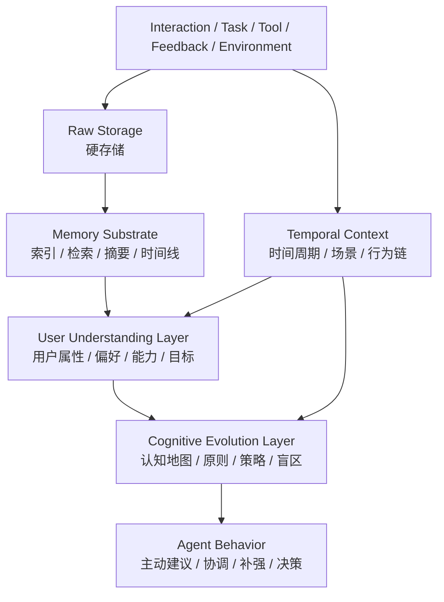

# 时间化记忆与用户理解模型

本文档是 forme 的 V12 规划补强。它承接 `06-cognitive-evolution-kernel-assessment.md`、`11-cognitive-map-trust-and-failure-evidence.md` 和 `12-unified-gateway-and-communication-fabric.md`，专门修正并深化 memory、用户理解和长期认知之间的关系。

本文仍然是规划文档，不进入 Rust 模块、数据库 schema、API 或实施型 PRD。它的作用是给后续 requirements、architecture 和 PRD 一个更准确的边界：forme 的长期记忆和用户理解最终会形成大型结构化存储，但它应当通过时间、交互、任务、行为、环境、反馈和反思逐步生长，而不是通过一次性全量导入外部平台历史数据来静态塑造用户。

## 核心结论

forme 不应把“记忆”理解成普通存储，也不应把“认知”理解成摘要。

更准确的定义是：

> forme 的记忆系统是支撑 Agent 进化的时间化认知底座。它可以沉淀大量数据、索引和结构化对象，但高阶用户理解、稳定记忆、认知地图、原则和策略必须从过程证据中逐步生长，并经过候选、验证、提升和回滚治理。

因此，forme 不是不要长期数据库。相反，forme 最终会形成很大的用户记忆和认知数据库。但这个数据库的形成方式必须是过程化的：

```text
交互 / 任务 / 工具执行 / 反馈 / 外部观察 / 主动学习
  -> 原始证据
  -> 时间化事件
  -> 片段记忆
  -> 反思记录
  -> 用户属性候选
  -> 认知更新候选
  -> 验证 / 冲突检查 / 用户确认
  -> 稳定记忆 / UserModel / CognitiveMap / Principle / Strategy
```

这和一次性导入式数据湖不同：

```text
外部平台历史数据全量拉取
  -> 静态结构化
  -> 一次性总结用户
```

后者缺少当时的行为链、环境状态、目标、动机、反馈和交互关系，容易形成片面甚至错误的用户理解。

## 记忆机制的取舍

forme 采用的机制：

- 分层摘要和检索机制。
- 来源追溯。
- 后台整理和 post-turn archivist 思路。
- quiet tick：没有有效变化时不运行模型。
- diff-based awareness：只处理和授权观察、目标、任务或学习议题相关的变化。
- 外部触发行为的 taint / approval gate。

forme 不采用的方向：

- 默认接入大量 SaaS 平台。
- 自动拉取全部历史数据。
- 先构建个人数据湖再理解用户。
- managed service / OAuth connector 作为核心前提。
- 用历史资料一次性塑造稳定用户画像。

更准确的边界是：

```text
forme 可以形成长期数据库，
但不能把脱离过程语境的历史数据当成完整用户现实。
```

## 分层模型

本部分建议把 forme 的记忆和用户理解拆成四层。



### 1. Raw Storage

硬存储负责保存事实，不负责解释事实。

它可以存储：

- 对话记录。
- run / session / turn 事件。
- 工具调用和输出。
- 文件变更和 artifact。
- 外部资料和检索结果。
- 用户反馈、纠正、审批和撤销。
- 失败记录和验证结果。
- 主动式观察和机会候选。
- 时间戳、来源、权限范围、workspace、project、channel、surface。

硬存储可以使用结构化数据库、全文索引、向量索引和对象存储。但硬存储只表示“发生过什么”，不能直接表示“用户是什么样的人”或“Agent 以后应该怎么判断”。

### 2. Memory Substrate

Memory Substrate 负责把硬存储变成可检索、可压缩、可追溯的运行资源。

它应提供：

- 时间线。
- 事件聚合。
- 主题索引。
- 实体索引。
- 向量检索。
- 全文检索。
- 摘要和分层摘要。
- 来源追溯。
- 证据链。
- 记忆 scope：user、workspace、project、session、channel、task。

这一层的重点不是全量同步数据源，而是把过程中产生的证据组织成可用记忆。

### 3. User Understanding Layer

User Understanding Layer 负责形成并维护 `UserModel`。

`UserModel` 不是静态 profile，也不是用户偏好列表，而是服务于特定用户的全维度、可演化、有置信度、有时间周期的理解模型。

它至少应覆盖：

- 基本事实。
- 长期目标。
- 当前阶段目标。
- 工作方式。
- 沟通偏好。
- 决策风格。
- 风险偏好。
- 授权习惯。
- 工具偏好。
- 表达习惯。
- 知识结构。
- 能力结构。
- 强项。
- 短板。
- 容易反复出现的问题。
- 需要被 Agent 补强的地方。
- 项目关系。
- 人际关系。
- 价值判断。
- 明确不喜欢或禁止的事项。
- 打扰敏感度和主动式接受度。

每个用户属性都必须带元数据：

```text
source_evidence
confidence
last_updated_at
first_observed_at
stability
decay_policy
scope
contradictions
promotion_history
user_feedback
```

也就是说，用户属性不是一句结论，而是一个可追溯、可降级、可冲突检查、可撤销的认知对象。

### 4. Cognitive Evolution Layer

Cognitive Evolution Layer 负责把“知道用户什么”转化为“如何更好地服务用户”。

它包括：

- `CognitiveMap`。
- `JudgmentFrame`。
- `QualityModel`。
- `BlindSpotModel`。
- `PartnershipModel`。
- proposal 级主动补强策略。
- `AgentSelfModel`。
- `PrincipleStore`。
- `StrategyStore`。
- `TrustProfile`。
- `DelegationPolicy`。

示例：

```text
UserModel 候选发现：
  用户经常快速推进方向，但容易后补边界约束。

CognitiveMap 候选形成：
  架构规划任务必须先检查目标、非目标、外部方案是否会带偏。

StrategyStore 候选形成：
  当用户引入外部方案时，Agent 应先区分“机制参考”和“方向参考”。

Agent 行为表现：
  主动提醒“这个方案只能提供机制启发，不能改变 forme 主线”。
```

这才是记忆进入 Agent 行为的完整路径。

## 时间尺度

用户属性、记忆和认知不是同一种变化速度。forme 必须从一开始支持时间尺度，避免把短期状态写成长期人格，也避免把长期稳定偏好当成临时会话变量。

下表是 `UserModel` 维度的时间尺度细分；它们不另立一套独立尺度，而是映射到 `../../architecture/canonical-contract.md` §4 的 canonical 稳定性枚举：`identity_constraints` → fixed/constitutional，`stable_traits` → stable，`working_preferences` → working，`current_focus` → working/session，`session_state` → session。

| 时间尺度 | 示例 | 更新频率 | 写入要求 |
|---|---|---|---|
| `session_state` | 当前对话目标、当前情绪、当前任务偏好。 | 分钟 / 小时 | 可快速更新，但默认只在当前 session 有效。 |
| `current_focus` | 当前项目、最近阶段目标、近期关注点。 | 天 / 周 | 需要近期多事件或用户明确确认。 |
| `working_preferences` | 文档优先、中文沟通、严谨审查、先规划后实现。 | 周 / 月 | 需要多次证据或强用户反馈。 |
| `stable_traits` | 长期价值判断、稳定工作方式、长期风险偏好。 | 月 / 年 | 必须高置信、多证据、可回滚。 |
| `identity_constraints` | 用户明确禁止、隐私边界、授权边界。 | 长期稳定 | 必须显式证据，更新需要强确认。 |

稳定性不等于永不变化。人的偏好、目标、能力和认知都会变化，只是变化速度不同。Agent 需要记录这种变化，而不是冻结用户。

## 过程证据和历史证据

forme 应区分两类证据。

### Process Evidence

过程证据来自 Agent 与用户共同经历的过程：

- 用户在当前交互中的表达和纠正。
- Agent 执行任务的过程。
- 工具调用结果。
- 用户采纳、拒绝、修改、撤销。
- 失败、验证和后续修正。
- 主动建议的反馈。
- 长期目标推进过程。

过程证据的权重更高，因为它带有时间、行为、环境、目标和反馈。

### Imported Historical Evidence

历史导入证据来自外部历史资料或一次性导入：

- 过去聊天记录。
- 历史邮件。
- 历史文档。
- 旧项目资料。
- 第三方平台导出的数据。

这些资料可以进入 forme，但必须标记为：

```text
ImportedHistoricalEvidence
```

它可以用于：

- 补充背景。
- 发现候选主题。
- 辅助建立初始理解。
- 帮助用户回溯。
- 作为待验证线索。

它不能直接用于：

- 稳定用户画像。
- 稳定认知判断。
- 长期原则更新。
- 自动放权。
- 高置信行为推断。
- 高影响主动行动。

原因不是历史数据没有价值，而是它缺少当时的行为链、环境状态和反馈关系。

## UserModel 写入规则

`UserModel` 的更新必须走候选链路。

```text
EvidenceEvent
  -> UserSignal
  -> UserAttributeCandidate
  -> ConflictCheck
  -> ConfidenceUpdate
  -> PromotionDecision
  -> UserModelAttribute
```

### 不允许的写入

- 一次对话直接写入长期稳定用户属性。
- 一次历史导入直接生成稳定人格判断。
- 一次失败直接判定用户长期短板。
- 一次成功直接提升 trust 或 delegation。
- 外部沟通对象的描述直接覆盖用户自己的表达。
- 模型根据常识推断用户未表达的敏感属性。

### 允许的写入

- 用户明确说出的偏好可以进入高置信候选。
- 多次重复行为可以提升某个工作偏好的置信度。
- 用户纠正 Agent 的行为可以作为强反馈。
- 失败证据可以生成短板候选，但不能直接稳定化。
- 历史资料可以生成低置信候选，并等待后续过程验证。
- 用户明确确认后，可以提升为稳定属性。

## 记忆链和认知链

forme 需要同时区分 memory chain 和 cognitive chain。（记忆 vs 认知的 canonical 边界见 `../../architecture/canonical-contract.md` §14：memory chain 产"记忆"（素材，Reflection 及以下）；cognitive chain 产"认知"（Semantic 及以上，已在指导判断）。）

Memory chain 负责从证据形成可用记忆：

```text
RawEvent
  -> EventMemory
  -> EpisodicMemory
  -> ReflectionMemory
  -> CandidateMemory
  -> VerifiedMemory
  -> StableMemory
```

Cognitive chain 负责从记忆形成判断和行为策略：

```text
StableMemory / CandidateMemory
  -> UserModelUpdateCandidate
  -> CognitiveMapUpdateCandidate
  -> PrincipleCandidate
  -> StrategyCandidate
  -> Verification / Replay / User Feedback
  -> Stable Cognitive Object
  -> Agent Behavior
```

这两条链不能混成一个“memory summary”。Memory summary 可以进入上下文，但 summary 不能替代候选、验证和提升流程。

## 对主动式的影响

主动式 Agent 必须依赖 UserModel，但不能被 UserModel 无限放大。

主动式判断至少应参考：

- 当前 `session_state`。
- 当前 `current_focus`。
- 相关 `working_preferences`。
- 相关 `CognitiveMap`。
- 近期 `FailureEvidence`。
- 用户的 `interruption_tolerance`。
- 当前 `DelegationGrant` 和 `AutonomyEnvelope`。
- 是否存在明确授权观察范围。

主动式输出必须区分：

- 只记录。
- 延迟总结。
- 轻提醒。
- 主动追问。
- 准备材料。
- 请求审批执行。
- 低风险预授权执行。

其中，外部历史数据只能作为辅助背景，不能单独触发高影响主动行为。

## 对协调内核的影响

Coordination Kernel 需要从 UserModel 和 Temporal Memory 中读取资源判断依据。

它不应只问“有哪些工具”，还应问：

- 用户当前目标是什么。
- 当前目标属于短期任务还是阶段目标。
- 用户偏好的完成标准是什么。
- 用户对打扰、风险和外部动作的接受度是什么。
- 类似任务过去如何失败。
- 这个项目中哪些资料、工具、skills 或来源更可信。
- 哪些用户属性是稳定的，哪些只是当前状态。
- 哪些判断来自过程证据，哪些只是历史导入候选。

因此，`ResourcePlan`、`DoneContract` 和 `AutonomyEnvelope` 应能引用：

```text
UserModelAttributeRef
TemporalMemoryRef
ImportedHistoricalEvidenceRef
CognitiveMapRef
FailureEvidenceRef
TrustProfileRef
```

这些引用必须进入 `DecisionTrace`，让用户和开发者知道 Agent 为什么这么判断。

## 对 M0 的要求

M0 不需要实现完整长期记忆系统，但必须把边界做对。

M0 至少应具备：

- append-only event log。
- session history。
- memory summary 边界。
- candidate memory 与 stable memory 区分。
- `UserModel` 数据边界。
- `UserAttributeCandidate` 数据边界。
- `UserModelAttribute` 的 evidence、confidence、stability、scope、decay metadata 边界。
- `ImportedHistoricalEvidence` 标记。
- 过程证据优先于历史导入证据的提升规则。
- 用户可以查看、拒绝、降级或确认关键用户属性候选。
- 任何稳定用户属性、长期偏好、能力短板、信任提升都不能由单次事件直接写入。

M0 可以做得朴素，但不能把 memory 简化成一个字符串摘要，也不能把 UserModel 只写成 prompt 里的 profile 文本。

## 后续阶段

| 阶段 | 方向 |
|---|---|
| M0 | 定义时间化记忆边界、UserModel 候选链路、ImportedHistoricalEvidence 标记和基础事件证据。 |
| M1 | 增强 topic memory、UserModel review、用户属性冲突检查、候选确认体验和 session/project scope 检索。 |
| M2 | 引入多时间尺度 memory、长期目标、channel scoped memory、selective resource intake 和更强的用户理解面板。 |
| M3 | 引入 replay/eval 驱动的认知提升、策略提升、trust/delegation 校准和长期用户模型演化治理。 |

## 当前结论

forme 不应把记忆系统设计成“先收集所有历史数据再分析用户”。它应该设计成“在持续协作中形成可追溯、可验证、可回滚的用户理解和认知结构”。

这条路线允许 forme 最终拥有大型长期数据库，但这个数据库是时间化、过程化、证据化的。它的价值不只是存下了什么，而是记录了这些理解如何形成、在什么场景下有效、有哪些矛盾、是否被用户确认、是否还能被撤销。
