# forme 文档关系矩阵

本文档用于治理 `docs/` 下各类文档的关系，避免文档互相脱节、重复定义或绕过上游约束。

## 总体判断

当前文档已经有统一的主控入口。M0-M5 均已走完 `requirements -> canonical -> architecture -> PRD -> implementation -> acceptance` 并合入 main；S1-S99、97 EventKinds、真实 ecosystem golden、typed artifacts 与 release audit 是永久回归基线。当前不创造 M6，而是沿 `requirements/15-16 -> canonical §28 -> architecture/09 -> prd/23` 闭合 V1 默认大脑运行时，保持 18-crate 图、前 97 exact prefix 与 single authority。

维护原则：

- 全局入口是 `docs/README.md`，本文档是跨目录关系矩阵，各子目录 `README.md` 只解释本目录内部文档。
- 早期规划 `planning/01-14` 与早期架构基线 `architecture/00-01` 已归档到 `archive/`，不再更新，不作为现行口径。
- M0-M5 的 requirements、architecture、PRD 与 acceptance 是冻结的回归基线；V1 核心大脑闭合按 `prd/23` A/B/C/D 实施，不新增里程碑编号。

## 目录级关系

| 目录 | 回答的问题 | 上游输入 | 下游输出 | 状态 | 风险控制 |
|---|---|---|---|---|---|
| `planning/` | 仍在使用的规划设计。 | 早期规划（已归档）与 requirements 反馈。 | 多 Agent 编排的单脑模型与编排库。 | 当前仅 `15`。 | 规划结论必须再进入 requirements 固定。 |
| `requirements/` | 要做什么、不做什么、优先级、范围决策和验收方向。 | 早期规划（已归档）与各阶段验收结论。 | 需求范围、能力域、完整核心闭环、非目标、验收方向。 | M0-M5 已落地；`15`-`16` 冻结 V1 核心大脑闭合且不是 M6。 | 不写实现细节，不扩大 planning 未确认的范围。 |
| `architecture/` | 如何实现 requirements。 | `requirements/` 与 canonical 契约。 | Rust 模块、协议、状态机、数据流、存储、安全和扩展设计。 | M0-M5 已实现；`09` 冻结 V1 闭合且保持 18 crates/single authority。 | `00/01` 不当作最终技术方案；新增范围必须从 requirements 下推。 |
| `prd/` | 按什么功能和步骤实现。 | `requirements/` 与 `architecture/`。 | 可执行任务、接口/数据约束、测试和验收。 | `01`–`22` 已实现；`23` 是当前 A-D 实施契约。 | 不在 PRD 中新增需求或复制第三方实现。 |
| `acceptance/` | 如何证明实现符合 requirements 与 PRD。 | 实现、场景测试、合规门。 | 逐场景证据、最终门结果、残余风险。 | M0-M5 均有 final 证据；V1 闭合待产出 A/B/C/D 与 final 证据。 | 不能只用最终回答或 happy path 代替事件序列和反向断言。 |
| `compliance/` | 依赖来源与许可证是否清楚。 | `Cargo.lock`、direct dependencies。 | 依赖清单。 | 随依赖维护。 | 发布审计读取，不能与实际依赖脱节。 |
| `archive/` | 设计是如何演进过来的。 | 早期规划与架构基线。 | 无（只读）。 | 已归档。 | 不作为现行口径，冲突时以 canonical 与 requirements 为准。 |

## 当前主文档关系

| 文档 | 当前角色 | 主要上游 | 主要下游 | 关系说明 |
|---|---|---|---|---|
| `architecture/canonical-contract.md` | 跨文档唯一口径契约。 | `archive/planning/01-14`、`planning/15`、requirements、外部 review 反馈。 | 全部正式 architecture/PRD。 | §1-28 收敛三内核、治理、输入安全、模型潮线、M2-M5 与 V1 核心大脑运行闭合。 |
| `planning/15-multi-agent-orchestration.md` | 多 Agent 执行编排补强。 | 早期协调内核与自我模型规划（已归档）、`architecture/02-proactive-cognitive-kernel`、`requirements/02` R12。 | requirements 中 subagent/delegation、Orchestrator、Workspace 边界；architecture 中协调、执行、并发与冲突治理的引用关系。 | 单脑模型（认知集中、执行分布）：Orchestrator 非内核、子代理无认知、资源统一在大脑、结果整合回大脑。 |
| `requirements/01-vision-and-scope.md` | 第一份需求文档。 | `archive/planning/01-14`、`planning/15`。 | `requirements/02-capability-requirements.md`。 | 已固定愿景、用户、问题、范围、非目标和关键约束。 |
| `requirements/02-capability-requirements.md` | 能力需求文档。 | `requirements/01`、`archive/planning/05-14`。 | `requirements/03-foundation-scope-decisions.md`。 | 已固定能力域、阶段边界和验收方向，并被 `03` 进一步收敛 M0 范围。 |
| `requirements/03-foundation-scope-decisions.md` | M0 范围决策文档。 | `requirements/02`、用户对 M0 不应缩水的修正。 | `requirements/04-verification-and-acceptance-strategy.md`、`architecture/03`。 | 固定 M0 是完整核心体系的第一条可运行闭环。 |
| `requirements/04-verification-and-acceptance-strategy.md` | 验证与验收策略文档。 | `requirements/03`。 | `architecture/03`、`prd/01`。 | 固定 M0 如何被证明，不让后续架构只停留在概念。 |
| `architecture/02-proactive-cognitive-kernel.md` | 主动认知内核设计基准（设计叙事）。 | `archive/planning/01-14`、`planning/15`、`requirements/01-04`、`archive/architecture/00-01`、`canonical-contract`。 | `architecture/03`、`prd/01`。 | 固化记忆图、认知地图、进化引擎、协调、主动机制、能力门、性格、对外膜和 runtime 接缝；同名对象口径以 `canonical-contract` 为准。 |
| `architecture/03-foundation-architecture.md` | 正式技术方案（完成）。 | `requirements/01-04`、`archive/architecture/00-01`、`canonical-contract`、`02-proactive-cognitive-kernel`。 | `prd/01-foundation-implementation-prd.md`。 | 完成：骨架（§0–9：crate 边界/协议/M0 数据流/承重墙/认知层 trait/治理 enforce/存储/M0 边界）+ 详篇（完整事件分类 §2.1.1、承重墙 §4.7 + 认知层 §5.6 trait 签名）。 |
| `prd/01-foundation-implementation-prd.md` | M0 PRD 体系**总纲**（Program PRD）。 | `requirements/01-04`、`architecture/03`、`canonical-contract`。 | `prd/02`..`17`、Rust 实现、M0 验收。 | 总纲与模块 PRD `02`–`17` 全部完成并实现。 |
| `acceptance/m0-acceptance-report.md` | M0 最终验收报告。 | `prd/01` §7、S1–S22 测试、compliance doctor。 | M0 封版与 M1 回归基线。 | 完成：18 crates、164 Rust tests、8 compliance fixtures、S1–S22 与合规门全绿。 |
| `requirements/05-m1-scope-decisions.md` | M1 范围决策。 | `requirements/02-03`、M0 验收。 | `requirements/06`、`architecture/04`。 | 完成：固定 M1-A/B/C 与非目标。 |
| `requirements/06-m1-verification-strategy.md` | M1 验收策略。 | `requirements/05`、M0 S1–S22。 | `architecture/04`、`prd/18`。 | 完成：S23–S37。 |
| `architecture/04-m1-experience-architecture.md` | M1 增量架构。 | `requirements/05-06`、M0 architecture/canonical。 | `prd/18`、M1 runtime。 | M1-A/B/C 均已激活；不新增内部 crate 边并保持 86 个 EventKind。 |
| `architecture/m1-a-protocol-compatibility.md` | M1-A protocol migration note。 | `architecture/04`、`prd/18`。 | protocol consumer 与后续 M1 波次。 | 已随 M1-A 落地。 |
| `architecture/m1-b-protocol-compatibility.md` | M1-B protocol migration note。 | `architecture/04`、`prd/18`。 | scheduler/proactivity/notification consumer 与 replay。 | 已随 M1-B 落地。 |
| `architecture/m1-c-protocol-compatibility.md` | M1-C protocol migration note。 | `architecture/04`、`prd/18`。 | MCP action consumer、ConfigDoctor 与 replay。 | 已随 M1-C 落地；旧 MCP payload 可读但不可直接执行。 |
| `prd/18-m1-program-prd.md` | M1 Program PRD。 | `requirements/05-06`、`architecture/04`。 | M1-A/B/C 实现与最终验收。 | 完成：M1 final PASS。 |
| `acceptance/m1-a-acceptance-report.md` | M1-A 波次验收报告。 | `requirements/06` S23-S28、M1-A tests、M0 回归与 compliance doctor。 | M1-B 准入和 M1-A 回归基线。 | 完成：18 crates、182 Rust tests、9 compliance fixtures、S1-S28 全绿。 |
| `acceptance/m1-b-acceptance-report.md` | M1-B 波次验收报告。 | `requirements/06` S29-S33、M1-B tests、M1-A/M0 回归与 compliance doctor。 | M1-C 准入和 M1-B 回归基线。 | 完成：18 crates、194 Rust tests、9 compliance fixtures、S1-S33 全绿。 |
| `acceptance/m1-c-acceptance-report.md` | M1-C 波次验收报告。 | `requirements/06` S34-S37、M1-C tests、M1-A/B/M0 回归与 compliance doctor。 | M1 final 真实模型准入和 S1-S37 回归基线。 | 完成：18 crates、203 Rust tests、9 compliance fixtures、S1-S37 全绿。 |
| `acceptance/m1-real-model-golden-report.json` | 真实配置模型 typed `ManualEvalReport`。 | repository-owned golden case、Gateway/Harness event stream。 | M1 final 验收。 | PASS：18 个 trace refs 与权威事件一一对应，不含 secret。 |
| `acceptance/m1-real-model-golden-trace.json` | 真实模型 portable trace manifest。 | 权威 SSE event stream、typed report。 | 离线解析 report refs 与 M1 final artifact gate。 | PASS：保存连续 `stream_seq/event_id/kind`、snapshot、usage 和禁止事件断言。 |
| `acceptance/m1-acceptance-report.md` | M1 最终验收报告。 | A/B/C 报告、S1-S37、真实模型 golden、compliance doctor。 | M2 准入与 M1 回归基线。 | 完成：M1 final PASS。 |
| `requirements/07-m2-scope-decisions.md` | M2 范围决策。 | `requirements/02-03`、M1 D33/验收、canonical §23-24。 | `requirements/08`、`architecture/05`。 | 冻结 D36-D55 与 A/B/C、M3 非目标。 |
| `requirements/08-m2-verification-strategy.md` | M2 验收策略。 | `requirements/07`、S1-S37。 | `architecture/05`、`prd/19`、M2 acceptance。 | 冻结 S38-S52 与逐波/最终门。 |
| `architecture/05-m2-cross-system-collaboration-architecture.md` | M2 增量架构。 | `requirements/07-08`、canonical §24、M0/M1 architecture。 | `prd/19`、M2 runtime。 | M2-A/B/C 已实现并验收；无新内部 edge，EventKind 保持 86。 |
| `architecture/m2-a-protocol-compatibility.md` | M2-A protocol compatibility note。 | `architecture/05`、`prd/19`。 | protocol consumer/replay。 | 已激活 additive enum/payload、安全默认与执行拒绝边界；EventKind 保持 86。 |
| `architecture/m2-b-protocol-compatibility.md` | M2-B protocol compatibility note。 | `architecture/05`、`prd/19`。 | AppApi/communication consumer 与 replay。 | 已激活 AppApi、DisclosureBinding 与 Connector row；legacy 缺 binding 不授权发送。 |
| `architecture/m2-c-protocol-compatibility.md` | M2-C protocol compatibility note。 | `architecture/05`、`prd/19`。 | graph/goal/growth/plugin/memory/store consumer。 | 已激活 additive DTO/payload 与 VersionedEventStore；冻结 EventStore 和 86 EventKinds 不变。 |
| `prd/19-m2-program-prd.md` | M2 Program PRD。 | `requirements/07-08`、`architecture/05`。 | M2-A/B/C 实现与验收。 | 完成：M2 final PASS。 |
| `acceptance/m2-a-acceptance-report.md` | M2-A 波次验收报告。 | `requirements/08` S38-S42、S1-S37、真实 Chrome、合规门。 | M2-B owner review 准入与 M2-A 回归。 | 完成：18 crates、218 Rust tests、S1-S42 与 real-world artifact gate 全绿。 |
| `acceptance/m2-b-acceptance-report.md` | M2-B 波次验收报告。 | S43-S47、A/M1/M0 回归、真实 API/communication。 | M2-C owner review 准入。 | 完成：S1-S47 与真实 browser/API/communication 全绿。 |
| `acceptance/m2-c-acceptance-report.md` | M2-C 波次验收报告。 | S48-S52、A/B/M1/M0 回归、CAS/sync/secret scan。 | M2 final。 | 完成：252 个非忽略 Rust tests、S1-S52 与全门禁 PASS。 |
| `acceptance/m2-acceptance-report.md` | M2 最终验收报告。 | A/B/C 报告、S1-S52、真实世界 typed artifacts、compliance。 | 后续里程碑回归基线。 | 完成：M2 final PASS。 |
| `acceptance/m2-a-browser-golden-report.json` | M2-A 真实浏览器 typed eval。 | Harness 权威 event stream、loopback server ground truth。 | M2-A artifact gate。 | PASS：one-shot approval 后 mutation 严格一次，35 trace refs，不含 secret。 |
| `acceptance/m2-a-browser-golden-trace.json` | M2-A portable trace manifest。 | typed eval、权威事件与 Browser receipt。 | 离线顺序/provenance/secret 复核。 | PASS：`stream_seq=1..35` 连续，external output/receipt 为 Untrusted。 |
| `requirements/09-m3-scope-decisions.md` | M3 范围决策。 | `requirements/02-03`、M2 final、canonical §25。 | `requirements/10`、`architecture/06`。 | 已冻结：D56-D75、A/B/C、M3 非目标。 |
| `requirements/10-m3-verification-strategy.md` | M3 验收策略。 | `requirements/09`、S1-S52。 | `architecture/06`、`prd/20`、M3 acceptance。 | 已实现：S53-S69 与逐波/final 门全部 PASS。 |
| `architecture/06-m3-controlled-evolution-architecture.md` | M3 增量架构。 | `requirements/09-10`、canonical §25、M0-M2 architecture。 | `prd/20`、M3 runtime。 | M3-A/B/C 已实现；18-crate 图不变，EventKind 保持 89。 |
| `architecture/m3-a-protocol-compatibility.md` | M3-A common evolution protocol note。 | `architecture/06`、`prd/20`。 | protocol/store/eval/harness consumer。 | 已激活：89-kind、legacy/default/effect-mode contracts PASS。 |
| `architecture/m3-b-protocol-compatibility.md` | M3-B domain strategy protocol note。 | `architecture/06`、`prd/20`。 | loop/coordination/capability/model consumer。 | 已激活：strict/forbidden-field/domain compatibility PASS，不新增 EventKind。 |
| `architecture/m3-c-protocol-compatibility.md` | M3-C cognition/trust/proactivity protocol note。 | `architecture/06`、`prd/20`。 | cognition/memory/communication consumer。 | 已激活：authority/fixed/disclosure boundary fail closed，不新增 EventKind。 |
| `prd/20-m3-program-prd.md` | M3 Program PRD。 | `requirements/09-10`、`architecture/06`。 | M3-A/B/C 实现与验收。 | 完成：M3 final PASS。 |
| `acceptance/m3-a-acceptance-report.md` | M3-A 波次验收报告。 | S53-S57、S1-S52、89-kind、真实 browser artifacts、compliance。 | M3-B 准入与 M3-A 永久回归。 | 完成：M3-A PASS，owner 已通过。 |
| `acceptance/m3-a-artifacts/` | M3-A 五类 typed artifacts。 | 真实 browser Harness run 与 candidate/eval/activation/regression/rollback lineage。 | 离线 replay、digest、lineage、secret scan。 | PASS：35-event replay、42-event trace、五工件独立校验。 |
| `acceptance/m3-b-acceptance-report.md` | M3-B 波次验收报告。 | S58-S62、S1-S57、89-kind、long-horizon artifact、compliance。 | M3-C owner review 准入与 M3-B 回归。 | 完成：M3-B PASS，owner 已通过。 |
| `acceptance/m3-b-artifacts/` | M3-B long-horizon typed artifact。 | 三 checkpoint、snapshot pin、v1/v2/rollback、Browser outward lineage。 | 离线 digest、event sequence、secret/private-path scan。 | PASS：单工件封闭集，`fnv64:1325de753c05441a`。 |
| `acceptance/m3-c-acceptance-report.md` | M3-C 波次验收报告。 | S63-S69、S1-S62、真实 browser evolution golden、release audit。 | M3 final 与 S63-S69 永久回归。 | 完成：M3-C PASS。 |
| `acceptance/m3-c-artifacts/` | M3-C governed evolution typed artifact。 | candidate/eval/owner activation/v2 live/regression/rollback/v1 live 权威事件。 | 离线 lineage、plan digest、secret/private-path 与 tamper 校验。 | PASS：三次真实 loopback mutation，最终 active=v1。 |
| `acceptance/m3-release-audit-artifacts/` | M3 clean-tree release audit typed artifact。 | git/Cargo/license/NOTICE/borrowing/originality/artifact/RustSec 扫描。 | release-ready 工程证据。 | PASS：7 个阻断门；Linux-only advisories保留为不可达 observation。 |
| `acceptance/m3-acceptance-report.md` | M3 最终验收报告。 | A/B/C 报告、S1-S69、全部 typed artifacts 与全门禁。 | 后续里程碑固定回归基线。 | 完成：M3 final PASS。 |
| `requirements/11-m4-scope-decisions.md` | M4 冻结范围决策。 | `requirements/02-03`、M2/M3 deferred items、M3 final、canonical §26。 | `requirements/12`、`architecture/07`。 | 已冻结并落实：D76-D95、A/B/C、single authority 与 M5 非目标。 |
| `requirements/12-m4-verification-strategy.md` | M4 冻结验收策略。 | `requirements/11`、S1-S69。 | `architecture/07`、`prd/21`、M4 acceptance。 | 已落实：S70-S84、逐波/最终门、真实三进程 artifacts。 |
| `architecture/07-m4-federated-runtime-architecture.md` | M4 增量架构。 | `requirements/11-12`、canonical §26、M0-M3 architecture。 | `prd/21`、M4 runtime。 | 已实现：peer/authority/mTLS/lease/replication/handoff；18 crates、93 EventKinds。 |
| `architecture/m4-a-protocol-compatibility.md` | M4-A protocol compatibility note。 | `architecture/07`、`prd/21`。 | protocol/store/execution/harness/gateway。 | 已激活：89-kind exact prefix、4 个 additive events、remote wire/legacy defaults PASS。 |
| `architecture/m4-b-protocol-compatibility.md` | M4-B replication/control compatibility note。 | `architecture/07`、M4-A。 | store/replica/gateway/harness。 | 已激活：无新增 EventKind；filtered batch/cursor/owner-control ingress fail closed。 |
| `architecture/m4-c-protocol-compatibility.md` | M4-C continuity compatibility note。 | `architecture/07`、M4-A/B。 | coordination/harness/eval。 | 已激活：placement/checkpoint/handoff/scheduler DTO additive，不扩权。 |
| `prd/21-m4-program-prd.md` | M4 Program PRD。 | `requirements/11-12`、`architecture/07`。 | M4-A/B/C 实现与验收。 | 已完成：S1-S84 与 owner 完整验收 PASS；Browser 阻断已修复。 |
| `acceptance/m4-a-acceptance-report.md` | M4-A 波次验收报告。 | S70-S74、S1-S69、mTLS RemoteExecutor、typed artifacts。 | M4-B 与最终 owner 验收。 | 完成：M4-A 自验收 PASS。 |
| `acceptance/m4-b-acceptance-report.md` | M4-B 波次验收报告。 | S75-S79、A/M0-M3 回归、replica/owner control。 | M4-C 与最终 owner 验收。 | 完成：M4-B 自验收 PASS。 |
| `acceptance/m4-c-acceptance-report.md` | M4-C 波次验收报告。 | S80-S84、全回归、三进程 golden、release audit。 | M4 final owner 验收。 | 完成：M4-C 自验收 PASS。 |
| `acceptance/m4-artifacts/` | M4 五类 federation typed artifacts。 | 三进程 authority/executor/replica golden。 | 离线 digest/lineage/cursor/secret/tamper 验证。 | PASS：封闭五件套，content receipt `sha256:c24a84ef85d918654258a3108a5bf8bd5523361271e76dfdad529ce106319022`。 |
| `acceptance/m4-release-audit-artifacts/` | M4 clean-tree release/federation audit typed artifact。 | Git/Cargo/license/NOTICE/borrowing/originality/artifacts/RustSec/threat fixtures。 | owner release acceptance。 | PASS：8 个阻断门；current-tree receipt 可独立 verify/compare。 |
| `acceptance/m4-acceptance-report.md` | M4 最终验收报告。 | A/B/C、S1-S84、全部 typed artifacts、Browser owner 阻断修复与全门禁。 | M5 固定回归基线。 | 完成：owner 完整验收 PASS；已封板。 |
| `requirements/13-m5-scope-decisions.md` | M5 冻结范围决策。 | M4 final、canonical §1-26、能力生态 deferred items。 | `requirements/14`、`architecture/08`。 | 已冻结：D96-D115、声明式 package、single authority。 |
| `requirements/14-m5-verification-strategy.md` | M5 冻结验收策略。 | `requirements/13`、S1-S84。 | `architecture/08`、`prd/22`、M5 acceptance。 | 已冻结：S85-S99、real registry/authority/executor golden 与 release gate。 |
| `architecture/08-m5-governed-capability-ecosystem-architecture.md` | M5 增量架构。 | `requirements/13-14`、canonical §27、M0-M4 architecture。 | `prd/22`、M5 runtime。 | 已实现：publisher/admission/lifecycle/registry/distribution，18 crates 不变。 |
| `architecture/m5-a-protocol-compatibility.md` | M5-A protocol compatibility note。 | `architecture/08`、`prd/22`。 | protocol/store/capabilities/harness/gateway。 | 已激活：93-kind exact prefix、4 个 additive events 与 legacy fail-closed。 |
| `architecture/m5-b-protocol-compatibility.md` | M5-B lifecycle/approval/registry compatibility note。 | `architecture/08`、`prd/22`。 | protocol/store/capabilities/harness/gateway。 | 已激活：legacy admission 不产生 Installed/Enabled，plan/approval drift fail closed。 |
| `architecture/m5-c-protocol-compatibility.md` | M5-C distribution/artifact compatibility note。 | `architecture/08`、`prd/22`。 | protocol/harness/eval/release verifier。 | 已激活：M4-bound receipt、unknown recovery 与 stable evidence projection。 |
| `prd/22-m5-program-prd.md` | M5 Program PRD。 | `requirements/13-14`、`architecture/08`。 | M5-A/B/C 实现与验收。 | 完成：S1-S99 与最终工程门 PASS。 |
| `acceptance/m5-a-acceptance-report.md` | M5-A 波次验收报告。 | S85-S89、catalog/publisher/admission、全回归。 | M5-B。 | 完成：Supply-chain Trust Plane PASS。 |
| `acceptance/m5-b-acceptance-report.md` | M5-B 波次验收报告。 | S90-S94、lifecycle/registry/revoke、全回归。 | M5-C。 | 完成：Governed Lifecycle/Registry PASS。 |
| `acceptance/m5-c-acceptance-report.md` | M5-C 波次验收报告。 | S95-S99、三角色 golden、artifacts/release audit。 | M5 final。 | 完成：Federated Distribution/Release PASS。 |
| `acceptance/m5-artifacts/` | M5 publisher/admission/install/distribution/trace 五件套。 | 两次真实 registry/authority/executor golden。 | offline verifier 与 S99 artifact scan。 | PASS：deterministic content receipt `sha256:237570b140753cc57478a5f681c2487bf1448bab287c0cd562abf20b776bbcbc`。 |
| `acceptance/m5-release-audit-artifacts/` | M5 clean-tree ecosystem release audit typed artifact。 | Git/Cargo/NOTICE/borrowing/copy/artifacts/RustSec/threat fixtures。 | final release acceptance。 | PASS：9 个阻断门；current-tree receipt 可独立 verify/compare。 |
| `acceptance/m5-acceptance-report.md` | M5 最终验收报告。 | A/B/C、S1-S99、typed artifacts、strict gates 与 release audit。 | V1 核心大脑闭合永久回归基线。 | 工程结果已合入 main。 |
| `requirements/15-v1-core-brain-closure-scope-decisions.md` | V1 核心大脑闭合范围。 | M5 final、完整设计审查。 | `requirements/16`、canonical §28、`architecture/09`。 | 已冻结 B1-B24；不是 M6。 |
| `requirements/16-v1-core-brain-closure-verification-strategy.md` | V1 闭合验收策略。 | `requirements/15`、S1-S99。 | `architecture/09`、`prd/23`、closure acceptance。 | 已冻结 C1-C24、99-kind 与真实/重启/反向证据。 |
| `architecture/09-v1-core-brain-runtime-closure-architecture.md` | V1 默认大脑运行闭合架构。 | `requirements/15-16`、canonical §28、M0-M5 architecture。 | `prd/23`、A-D runtime。 | 文档冻结；保持 18 crates，仅追加两个 R 事件。 |
| `prd/23-v1-core-brain-closure-program-prd.md` | V1 闭合 Program PRD。 | `requirements/15-16`、canonical §28、`architecture/09`。 | A/B/C/D 实现与 C1-C24 验收。 | 文档冻结；按 A→B→C→D 实施中，尚无闭合验收证据。 |

## 依赖图

```mermaid
flowchart TD
  Arc["archive\n早期规划与架构基线"] --> Req1["requirements/01\n愿景与范围"]
  Req1 --> Req2["requirements/02\n能力需求"]
  Req2 --> Req3["requirements/03\nM0 范围决策"]
  Req3 --> Req4["requirements/04\n验证与验收策略"]
  Req4 --> K["architecture/02\n主动认知内核设计基准"]
  C["architecture/canonical-contract\n唯一口径契约"] --> K
  K --> A3["architecture/03\n正式实现架构"]
  C --> A3
  A3 --> Prd1["prd/01\n实施型 PRD"]
  Prd1 --> Impl["Rust workspace\nM0 实现"]
  Impl --> Accept["acceptance/M0\nS1-S22 + 合规门"]
  Accept --> Req5["requirements/05-06\nM1 范围 + S23-S37"]
  Req5 --> A4["architecture/04\nM1 增量架构"]
  A4 --> Prd18["prd/18\nM1 Program PRD"]
  Prd18 --> M1A["M1-A runtime\nGateway + control + eval"]
  M1A --> AcceptA["acceptance/M1-A\nS23-S28 + M0 回归"]
  AcceptA --> M1B["M1-B\nS29-S33"]
  M1B --> AcceptB["acceptance/M1-B\nS29-S33 + A/M0 回归"]
  AcceptB --> M1C["M1-C\nS34-S37"]
  M1C --> AcceptC["acceptance/M1-C\nS34-S37 + A/B/M0 回归"]
  AcceptC --> Final["acceptance/M1 final\n真实模型 golden + S1-S37"]
  Final --> Req7["requirements/07-08\nM2 范围 + S38-S52"]
  Req7 --> A5["architecture/05\n跨系统协作架构"]
  A5 --> Prd19["prd/19\nM2 Program PRD"]
  Prd19 --> M2A["M2-A\nBrowser + Computer + PTY"]
  M2A --> AcceptM2A["acceptance/M2-A\nS38-S42 + real Chrome"]
  AcceptM2A --> M2B["M2-B\nConnector + 真实沟通"]
  M2B --> AcceptM2B["acceptance/M2-B\nS43-S47"]
  AcceptM2B --> M2C["M2-C\nResource + Growth + Sync"]
  M2C --> AcceptM2C["acceptance/M2-C\nS48-S52"]
  AcceptM2C --> FinalM2["acceptance/M2 final\n真实世界 + S1-S52"]
  FinalM2 --> Req9["requirements/09-10\nM3 范围 + S53-S69"]
  Req9 --> A6["architecture/06\n受控进化架构"]
  A6 --> Prd20["prd/20\nM3 Program PRD"]
  Prd20 --> M3A["M3-A\nReplay + Eval + Activation + Rollback"]
  M3A --> ReviewM3A["owner review\nS53-S57"]
  ReviewM3A --> M3B["M3-B\nLoop + Coordination + Selection"]
  M3B --> ReviewM3B["owner review\nS58-S62"]
  ReviewM3B --> M3C["M3-C\nSelf + Partnership + Trust + Proactivity"]
  M3C --> FinalM3["acceptance/M3 final\nS1-S69 + release audit"]
  FinalM3 --> Req11["requirements/11-12\nM4 范围 + S70-S84"]
  Req11 --> A7["architecture/07\n单 Owner 联邦运行时"]
  A7 --> Prd21["prd/21\nM4 Program PRD"]
  Prd21 --> ReviewM4Spec["owner review\n规格冻结"]
  ReviewM4Spec --> M4A["M4-A\nPeer trust + RemoteExecutor"]
  M4A --> ReviewM4A["owner review\nS70-S74"]
  ReviewM4A --> M4B["M4-B\nReplication + owner control"]
  M4B --> ReviewM4B["owner review\nS75-S79"]
  ReviewM4B --> M4C["M4-C\nHandoff + federated golden"]
  M4C --> FinalM4["acceptance/M4 final\nS1-S84 + release audit"]
  FinalM4 --> Req13["requirements/13-14\nM5 范围 + S85-S99"]
  Req13 --> A8["architecture/08\n受治理能力生态"]
  A8 --> Prd22["prd/22\nM5 Program PRD"]
  Prd22 --> M5A["M5-A\nPublisher + Admission"]
  M5A --> M5B["M5-B\nLifecycle + Registry"]
  M5B --> M5C["M5-C\nDistribution + Release"]
  M5C --> FinalM5["acceptance/M5 final\nS1-S99 + release audit"]
  FinalM5 --> Req15["requirements/15-16\nV1 大脑闭合 B1-B24 + C1-C24"]
  Req15 --> A9["architecture/09\n核心大脑运行闭合"]
  A9 --> Prd23["prd/23\nV1 Closure Program PRD"]
  Prd23 --> ClosureA["A\n默认装配"]
  ClosureA --> ClosureB["B\n持续认知"]
  ClosureB --> ClosureC["C\n项目 + 编排"]
  ClosureC --> ClosureD["D\n产品闭合"]
  ClosureD --> FinalClosure["acceptance/V1 closure\nS1-S99 + C1-C24"]
```

## 后续写作准入

后续新增或修改主文档时，需要满足以下准入规则：

- 新文档必须能说清楚上游输入和下游输出。
- 规划文档可以提出候选，但不能把候选写成强制需求。
- 需求文档必须区分 M0/M1/M2/M3/M4/M5、V1 闭合计划、范围内、范围外和非目标；不得把闭合计划改名为 M6。
- 架构文档必须能追溯到 requirements，不能绕过需求新增能力。
- PRD 必须同时包含功能描述、实施步骤、测试和验收标准。
- 如果引入外部依赖、代码复用或协议兼容，必须记录来源、forme 重新设计方式和复制风险。

## 下一步建议

M0-M5 均已走完整条 `requirements -> architecture -> PRD -> implementation -> acceptance` 流水线并合入 main。下一步不自造 M6，按已冻结的 V1 核心大脑闭合链实施：

1. `acceptance/m5-acceptance-report.md` 与 `tools/verify-m5.ps1` 固定为 S1-S99 回归入口；M4 report/verify 继续作为内含历史门。
2. M2 86-kind 必须继续是 M3 89-kind、M4 93-kind、M5 97-kind 与 V1 closure 99-kind 的严格前缀；18-crate 图、Harness-first、执行前重查、能力门、candidate/activation/authorization 分离与 single authority 不可回退。
3. 按 `prd/23` A→B→C→D 实施；每波独立提交、验收报告并复跑 S1-S99，最终 C1-C24 和真实 golden/release gate 全绿。
4. `WorkspaceCharterChanged` 与 `DataLifecycleApplied` 是唯一获准的新事件；第三个新增事件或冻结 trait/依赖图变化必须先回文档经 owner 确认。
5. 任何公开发布仍由 owner 单独决定；release audit 是工程证据，不替代法律意见或外部发布授权。
