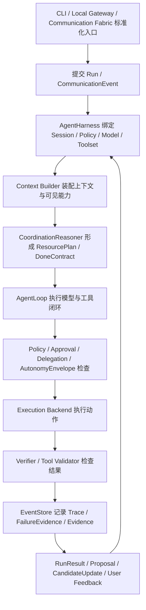

# M0 底座范围决策

本文档是 forme 的第三份需求文档。它承接 `01-vision-and-scope.md` 和 `02-capability-requirements.md`，专门固定 M0 的范围决策，避免后续架构方案把 M0 写成缩水 MVP、临时 CLI demo 或只预留数据边界。

本文仍然不进入 Rust crate 划分、接口签名、数据库表结构、具体算法和实施步骤。这些内容应进入后续 `docs/architecture/03-foundation-architecture.md` 和 `docs/prd/01-foundation-implementation-prd.md`。

## 核心结论

M0 的定义是：

> 完整核心体系的第一条可运行闭环。

M0 不是：

- 缩水 MVP。
- 临时 CLI wrapper。
- 只把对象和字段先定义出来。
- 把难的部分推迟到后面再补。
- 用“未来可扩展”替代当前必须成立的核心治理。

M0 可以在产品广度上收敛，例如不做完整桌面 UI、不做插件市场、不做全自动 L4/L5 自治、不做企业级策略中心。但 M0 不能在内核结构上缺失。凡是会决定 forme 是否是主动式、可进化、可协调、受治理 Agent 的部分，都必须在 M0 形成第一版可运行链路。

## 判断原则

M0 范围采用以下判断原则。

### 1. 核心链路必须闭合

如果一个能力是 AgentHarness、AgentLoop、Policy、Approval、Persistence、Capability、Execution、Gateway / Communication、Coordination、Cognition、Proactivity、FailureEvidence 或 Compliance 的硬依赖，M0 不能只写概念。

它至少要具备：

- 可提交。
- 可执行或可生成候选。
- 可被 policy 检查。
- 可被 event log 记录。
- 可被 trace 解释。
- 可被用户拒绝、暂停、撤销或降级。
- 可进入验证和失败证据。

### 2. 广度可控，结构不可缺

M0 可以只支持有限入口、有限 backend、有限 transport、有限主动观察源和有限验证方式，但每个核心子系统都必须以一等能力接入 harness，而不是作为后续外挂。

正确裁剪方式：

```text
保留完整内核路径
  + 限制入口数量
  + 限制 backend 类型
  + 限制自动化等级
  + 限制生态规模
```

错误裁剪方式：

```text
先做 CLI + 模型 + shell
  + 后面再补 event store
  + 后面再补 policy
  + 后面再补 gateway
  + 后面再补主动式和认知进化
```

### 3. 主动式和进化式必须早于产品体验

主动式和进化式学习不是 M2/M3 才出现的“高级功能”。M0 不需要做强自治，但必须证明主动式和进化式学习的最小受治理路径存在：

```text
Observation
  -> Opportunity
  -> ValueGate
  -> Proposal
  -> User Feedback
  -> Evidence
  -> Candidate Update
```

### 4. 协调性是第三核心，不是工具选择辅助

Coordination Kernel 不是“让模型挑工具”的 prompt 技巧。它是把目标、上下文、记忆、认知地图、工具、skills、MCP、模型、subagent、失败证据、信任状态和用户注意力协调成行动路线的元决策层。

M0 必须有最小 `CoordinationReasoner`，否则主动式和进化式学习无法稳定落到行动。

### 5. 开源约束从 M0 开始

forme 计划开源，因此原创性和合规边界不能等到发布前再补。M0 必须建立原创性与合规边界检查机制，确保代码、文档、命名、结构和产品表达均为原创，不复制第三方内容。

## M0 范围决策表

| 编号 | 主题 | M0 决策 | 不进入 M0 的部分 |
|---|---|---|---|
| D1 | 入口形态 | CLI 和 Local Gateway/App Server 都进入 M0。CLI 是人机入口，Local Gateway/App Server 是控制协议和未来 UI/API/后台任务入口。两者必须提交同一种 run，消费同一种 event。 | 完整 Web/Desktop UI、多端同步、远程云端控制面。 |
| D2 | 持久化 | M0 直接采用 SQLite/FTS 方向，并建立 append-only event log。run、session、turn、tool、approval、verification、failure、candidate update、user attribute candidate 都必须可追溯。 | 分布式存储、云同步、脱离过程语境的一次性全量个人数据湖。 |
| D3 | MCP | MCP 是一等能力。M0 支持 stdio transport、tools/resources discovery、allowlist、policy check、call events、timeout、错误分类和禁用策略。 | MCP marketplace、多 transport 全量支持、远端托管 MCP 生态。 |
| D4 | Skills | Skills 是过程记忆和能力组织方式。M0 支持 SkillRegistry、metadata、scope、version、trust boundary、按需加载和事件记录。 | 自动生成 skill、skill hub、跨用户 skill marketplace。 |
| D5 | Plugins | M0 支持 local plugin manifest 和贡献边界。插件可声明 tools、skills、MCP servers、hooks、config contribution，但必须 enable/disable、trust、policy、来源可追踪。 | 插件市场、远端安装更新、复杂插件 UI、未审计动态 ABI。 |
| D6 | 主动式 | M0 支持最小主动闭环：授权观察、机会识别、价值门控、能力门控、行动提议、用户反馈和证据记录。主动动作必须转成 proposal，由 `ProactiveEmissionGuard = ValueGate AND CompetenceGate AND Policy/AutonomyEnvelope` 治理，再交给 harness、policy 和 approval。 | 常驻看屏幕、默认读取全部文件或办公系统、无监督上网学习、自动外发消息、L4/L5 默认自治。 |
| D7 | 协调性 | M0 实现最小 `CoordinationReasoner`：从 GoalFrame、SituationModel、ResourceInventory、CognitiveMapRef、TrustProfileRef、FailureEvidenceRef 生成 ResourcePlan、DoneContract、AutonomyEnvelope 和 DecisionTrace。 | 自动进化默认 CoordinationSpec、复杂多 agent 团队、资源策略自动提升。 |
| D8 | 认知地图 | M0 允许生成低置信 `CognitiveMapUpdateProposal`，用于记录场景判断框架、质量标准、盲区和资源关系的候选更新。 | 自动提升为稳定认知、自动替换核心原则、自动修改默认 loop。 |
| D9 | 失败证据 | M0 不只记录 error log，还要形成 `FailureEvidence` 分类和 failure digest，并关联 trace、资源、验证、用户反馈和后续修正建议。 | 完整 eval 平台、自动 regression suite、全自动 prompt/harness hill-climbing。 |
| D10 | Delegation | M0 实现 `DelegationGrant` 和 `AutonomyEnvelope` 的运行时 enforcement。approval 支持受限预授权，但必须有 scope、期限、预算、动作类型、撤销和审计。trust 不能突破 permission。 | 高风险动作自动批准、无期限 trusted mode、组织级授权策略中心。 |
| D11 | Memory / UserModel | M0 区分 raw storage、memory substrate、session history、memory summary、candidate memory、stable memory、UserAttributeCandidate、UserModelAttribute 和 ImportedHistoricalEvidence。长期稳定写入必须 candidate-before-promotion；稳定用户属性必须有 evidence、confidence、stability、scope、时间戳、冲突和反馈边界。过程证据优先于历史导入证据，历史导入证据不能直接塑造稳定用户画像、自动放权或高影响主动行为。 | 完整 semantic memory manager、跨项目全局自动检索、全自动长期认知提升、一次性全量外部平台数据湖、自动从历史资料生成稳定用户画像。 |
| D12 | Approval | M0 的 approval protocol 必须 Gateway-compatible，不是 CLI-only。CLI 和 Local Gateway/App Server 共享 ApprovalRequest、ApprovalResolved、RunWaiting、RunResumed 事件。 | 多端审批 UI、企业审批流、复杂权限 DSL。 |
| D13 | Model / Config | M0 支持 ModelProvider、ModelProfile、credential、base_url、capability、cost/rate limit、config precedence、secrets 分离和 ConfigDoctor。 | 自动模型质量评测、复杂模型路由优化、GUI 配置中心。 |
| D14 | Verification | M0 支持 deterministic verifier、tool result validator、final output validator 和 trace export。验证结果必须进入 event log。 | 大规模 LLM judge、完整 eval 平台、自动修复所有验证失败。 |
| D15 | 原创与合规 | M0 从第一天建立 CI/doctor 方向的原创性与合规边界检查机制：不复制第三方源码、文档、prompt、错误信息、目录结构、命名体系或测试 fixture；本地参考材料不进入 build/import/include 路径；GPL 或未知许可证材料默认不进入主工程。 | 发布前完整法律审计、最终 LICENSE/NOTICE、依赖安全全量审计。 |
| D16 | Communication Fabric | M0 将统一沟通触手作为 Gateway 的一等子域。定义 text/voice/image/video、software/hardware carrier、ChannelAdapter、CommunicationSession、DisclosurePolicy、TerminationPolicy、ExternalCommunicationGrant、CommunicationProposal 和 Agent-to-Agent bounded session 的边界；M0 只跑通 text + CLI/Local Gateway 的标准事件路径。 | 真实多平台 adapter、真实麦克风/摄像头/电话系统、公网外部链接、实时语音/视频、Agent-to-Agent 协议实现。 |
| D17 | 并发与一致性 | M0 固定一致性不变量：同一 session 的 run 串行；event log 单写者；后台 ProactiveJob、IdleWork、reflection、subagent 和跨 session cognition 默认只读快照、只提交 candidate/proposal；稳定层按聚合串行写入。 | 分布式锁、跨设备实时同步、复杂并行事务调度。 |
| D18 | 撤销与派生失效 | M0 稳定对象必须记录 evidence -> object 和 object -> derived 双向血缘；撤销通过事件表达，并触发 CognitiveMap、TrustProfile、CoordinationPolicy、LoopSpec、PartnershipState 等引用者产生再评估候选。 | 全自动删除派生结论、复杂合规删除工作流、跨设备删除传播。 |
| D19 | Schema 与 Replay | M0 的 event、candidate 和 stable object 必须带 schema version；事件不可变，读时 upcast 或 projection migration；replay 必须记录 schema、policy、LoopSpec、model profile 和 tool schema snapshot。 | 完整 replay/eval 平台、自动迁移所有历史策略、M3 的 loop promotion 实验系统。 |

## M0 首个可运行闭环

M0 的闭环应按以下路径成立：



这条闭环说明：

- CLI 和 Gateway 只是入口，不拥有 loop。
- CoordinationReasoner 先定义目标、资源和完成标准，再让 loop 行动。
- 工具调用是 proposal，必须经过执行层 re-check。
- Delegation 和 AutonomyEnvelope 是运行时约束，不是 prompt 约束。
- 验证、失败和用户反馈必须回到事件和候选更新。
- 认知更新默认进入候选层，不直接污染稳定层。

## M0 的完整性边界

M0 必须完整覆盖这些结构：

1. `AgentHarness` 生命周期。
2. `AgentLoop` 执行闭环。
3. Run / Session / Turn / Event 协议。
4. CLI + Local Gateway/App Server 双入口。
5. SQLite/FTS + append-only event log。
6. Context / Memory / Skills metadata / Tool schema 分层。
7. ToolRegistry / ToolsetResolver / CapabilityRegistry。
8. MCP tools/resources 一等接入。
9. local skills registry 与按需加载。
10. local plugin manifest 与贡献治理。
11. Shell / File / MCP backend 第一版执行能力。
12. Policy / Approval / Audit。
13. DelegationGrant / AutonomyEnvelope enforcement。
14. CoordinationReasoner / ResourcePlan / DoneContract / DecisionTrace。
15. Proactive minimum loop。
16. 时间化记忆与 UserModel 候选边界：UserAttributeCandidate、UserModelAttribute、ImportedHistoricalEvidence、稳定性、置信度、时间尺度和过程证据优先级。
17. CognitiveMapUpdateProposal 候选生成。
18. FailureEvidence 分类与 digest。
19. deterministic verifier 与 trace export。
20. Model profile / config / secrets / ConfigDoctor。
21. Communication Fabric 数据边界：CommunicationEvent、CommunicationSession、ParticipantProfile、DisclosurePolicy、TerminationPolicy、ExternalCommunicationGrant、CommunicationProposal。
22. 原创性与合规边界检查机制。

这些结构可以在 M0 做得朴素，但不能缺席。

## M0 不承诺的能力

以下能力不进入 M0 承诺：

- 完整 Web/Desktop UI。
- 远程云端执行。
- 完整插件市场。
- Skill marketplace。
- MCP marketplace。
- 真实多平台沟通适配器矩阵。
- 公网外部沟通链接。
- 实时语音/视频通话。
- Agent-to-Agent 协议实现。
- BrowserBackend 全量能力。
- ComputerUseBackend。
- AppApi connector framework。
- 常驻桌面观察。
- 默认接入用户全部办公系统。
- 一次性全量拉取外部平台历史数据并静态塑造用户画像。
- 无监督主动上网学习。
- 自动外发消息。
- 自动 L4/L5 高自治。
- 自动进化默认 LoopSpec。
- 自动进化默认 CoordinationSpec。
- 完整长期 semantic memory manager。
- 自动从历史导入资料生成稳定用户画像。
- 完整 eval 平台。
- 企业级 managed policy。
- 开源发布前完整法律审计。

这些不进入 M0，不代表后续不做，而是因为它们属于产品广度、生态规模、高阶自治或发布治理，不是第一条核心闭环成立的必要条件。

## 与 M1/M2/M3 的关系

M0 之后的阶段不应理解为“补上 M0 缺掉的内核”，而应理解为“增强已经闭合的内核”。

| 阶段 | 主要任务 |
|---|---|
| M0 | 让完整核心体系第一次跑通，证明 harness、loop、policy、persistence、capability、coordination、proactivity、temporal memory、UserModel、cognition、failure evidence 和 compliance 可以在同一条受治理链路中工作。 |
| M1 | 增强真实使用体验：更好的 Gateway 控制台、background job、context compression、skill 按需加载、plugin runtime、trace viewer、manual eval、更多主动式工作流。 |
| M2 | 扩展跨系统协作：更多 observation source、API connector、browser/computer use、resource graph、长期目标、能力成长、managed plugin policy。 |
| M3 | 探索受控自进化：loop/coordination/capability/trust strategy 的 replay、eval、promotion、rollback 和 simulation。 |

## 对后续架构文档的约束

`docs/architecture/03-foundation-architecture.md` 必须从本文的 M0 决策出发，而不是重新裁剪 M0。

架构文档需要继续回答：

- 这些 M0 决策如何映射到 Rust 模块和进程边界。
- SQLite/FTS 与 append-only event log 如何建模。
- CLI 与 Local Gateway/App Server 如何共享 run/session/event/approval protocol。
- MCP、skills、plugins 如何统一进入 CapabilityRegistry。
- CoordinationReasoner 如何在 M0 可运行，但不固化成永久不可变工作流。
- Proactive minimum loop 如何受 policy、approval、feedback 和 event store 治理。
- Candidate memory、UserAttributeCandidate、ImportedHistoricalEvidence、CognitiveMapUpdateProposal、FailureEvidence、TrustProfile 如何在存储和事件上分层。
- 原创性与合规边界检查机制如何进入开发流程。

## 当前结论

forme 的 M0 应以“完整核心闭环”作为底线。它不追求产品广度和高阶自治，但必须从第一版开始证明：这个 Agent 不只是会调用工具，而是拥有受治理的运行时、持久化、能力基质、协调内核、主动式闭环、进化候选、失败学习、渐进放权和开源原创边界。
